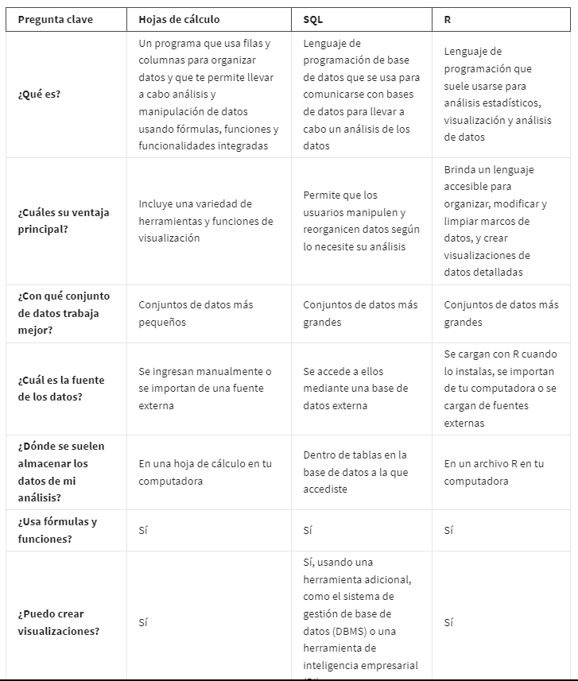

# Programar como analista de datos

## lenguajes de programacion

Un lenguaje de programación de uso general te permite crear tus propias aplicaciones y construir tus propias funciones
desde cero.

*Los lenguajes de programación* son las palabras y los símbolos que utilizamos para escribir instrucciones para que sigan
las computadoras.

Los lenguajes de programación tienen su propio conjunto de reglas sobre cómo deben usarse esas palabras y esos símbolos,
y se llama *sintaxis*. La sintaxis te muestra cómo organizar las palabras y los símbolos que ingreses para que tengan sen-
tido para la computadora.

*Codificar* es escribir instrucciones para la computadora utilizando la sintaxis de un lenguaje de programación
específico.

*Lenguajes para analisis de datos*:

R
Phyton
SAS
Scala
Julia

### Benefisios de los lenguajes de programacion en el area de analisis de datos

Aclarar los pasos de tu análisis:

    Los lenguajes de programación tienen reglas y pautas específicas para dar instrucciones a una computadora. Cuando le
    indicas a una computadora qué hacer, tus instrucciones tienen que ser muy claras. No puede haber ninguna incoherencia
    en la forma en que escribes el código. Si la hay, el código no funcionará. Traducir tus pensamientos en códigos te obliga
    a determinar exactamente cómo escribir cada paso de tu análisis y cómo hacer para que los pasos encajen. Le da a tu
    análisis un nivel de precisión que lo hace realmente poderoso.

Ahorrar tiempo

    tomemos el proceso de limpieza y transformación de datos. Con una línea de código puedes crear un conjunto de datos
    separado sin perder ningún valor. Con otra línea, puedes aplicar varios filtros a tus datos. Eso te permite emplear
    menos tiempo para preparar tus datos y más tiempo para el análisis en sí.

Reproducir y compartir tu trabajo con facilidad.

    El análisis de datos es más útil cuando puedes reproducir tu trabajo y compartirlo con otras personas. Ellas pueden
    volver a revisarlo y ayudarte a resolver problemas. El código almacena automáticamente todos los pasos de tu análisis
    para que puedas reproducirlo y compartir tu trabajo en cualquier momento a futuro, ya sean semanas, meses o incluso
    años después.

## hojas de calculo, SQl, R

Aqui un cuadro comparativo de las tres herramientas y cuando usarlas:

