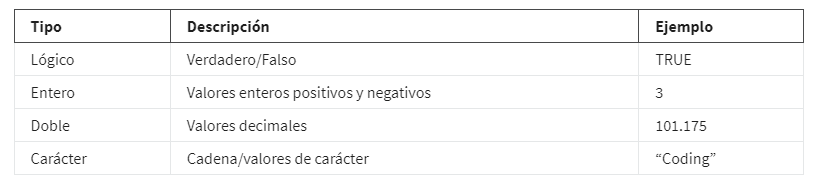
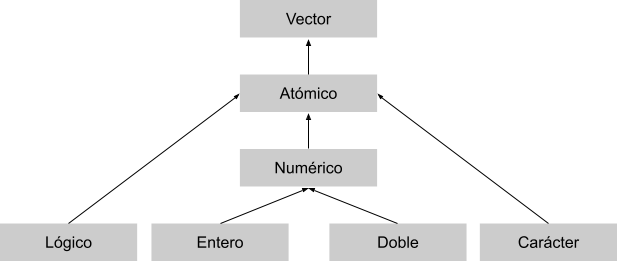

# Programar con RStudio

## Comprender los conceptos básicos de programación

En programación, una estructura de datos es un formato para organizar y almacenar datos. Es importante que conozcas las
estructuras de datos porque las usarás con frecuencia cuando utilices R para el análisis de datos. Las estructuras de
datos más comunes en el lenguaje de programación R incluyen:

### Vectores

Un vector es un grupo de elementos de datos del mismo tipo almacenado en una secuencia en R. No puedes tener un vector
que contenga valores lógicos y numéricos.

*Tipos de vectores:*

Existen dos tipos de vectores: vectores atómicos y listas. Luego, aprenderás sobre las propiedades básicas de los vectores
atómicos y las listas, y cómo utilizar el código R para crearlos.

Vectores atómicos

Primero, repasaremos los diferentes tipos de vectores atómicos. Luego, aprenderás cómo utilizar el código R para crear,
identificar y nombrar a los vectores.

Existen seis tipos primarios de vectores atómicos: lógicos, enteros, dobles, carácter (que contiene cadenas), complejos y
sin formato. Los dos últimos, complejo y sin formato, no son comunes en el análisis de datos, de modo que nos vamos a
concentrar en los primeros cuatro. Juntos, los vectores entero y doble son conocidos como vectores numéricos porque ambos
contienen números. Esta tabla resume los cuatro tipos primarios:

Este diagrama ilustra la jerarquía de relaciones entre estos cuatro tipos principales de vectores:

*Crear vectores:*

Una forma de crear un vector es utilizar la función c() (llamada función "combinar"). La función c() en R combina valores
múltiples en un vector. En R, esta función es solo la letra "c" seguida de los valores que deseas colocar en tu vector,
entre paréntesis, separados por una coma: c(x, y, z, …).

Por ejemplo, puedes utilizar la función c() para almacenar datos numéricos en un vector.

    v_1 <- c(2.5, 48.5, 101.5)

Para crear un vector de números enteros utilizando la función c(), debes colocar una "L" directamente después de cada número.

    v_2 <- c(1L, 5L, 15L)

También puedes crear un vector que contenga caracteres o valores lógicos.

    v_3 <- c(“Sara” , “Lisa” , “Anna”)

    v_4 <- c(TRUE, FALSE, TRUE)

*Determinar las propiedades de los vectores.*

Cada vector que creas tendrá dos propiedades clave: tipo y longitud.

Puedes determinar con qué tipo de vector estás trabajando mediante el uso de la función *typeof()*. Coloca el código para
el vector dentro del paréntesis de la función. Cuando ejecutes la función, R te dirá de qué tipo es. Por ejemplo:

    typeof(c(“a” , “b”))
    [1] "character"

Observa que el resultado de la función typeof en este ejemplo es la palabra “character”. Del mismo modo, si utilizas la
función typeof en un vector con valores enteros, el resultado va a incluir “integer”:

    typeof(c(1L , 3L))
    [1] "integer"

Puedes determinar la longitud de un vector existente, es decir, el número de elementos que contiene, utilizando la función
*length()*. En este ejemplo, podemos utilizar un operador de asignación para asignar al vector la variable x. Luego,
aplicamos la función length() a la variable. Cuando ejecutamos la función, R nos indica que la longitud es 3.

    x <- c(33.5, 57.75, 120.05)
    length(x)
    [1] 3

También puedes verificar si un vector es de un tipo específico mediante la función is:

    is.logical() is.double(), is.integer(), is.character()

En este ejemplo, R resulta TRUE porque el vector contiene valores enteros.

    x <- c(2L, 5L, 11L)
    is.integer(x)
    [1] TRUE

En este ejemplo, R arroja un valor de FALSE porque el vector no contiene caracteres, sino valores lógicos.

    y <- c(TRUE, TRUE, FALSE)
    is.character(y)
    [1] FALSE

*Nombrar vectores.*

Se puede poner nombre a todos los tipos de vectores. Los nombres son útiles para escribir códigos legibles y describir
objetos en R.

Puedes nombrar los elementos de un vector con la función *names()*. A modo de ejemplo, asignemos la variable x a un nuevo
vector con tres elementos.

    x <- c(1, 3, 5)

Puedes utilizar la función names() para asignar un nombre diferente a cada elemento del vector.

    names(x) <- c("a", "b", "c")

Ahora bien, cuando ejecutes el código, R mostrará que el primer elemento del vector se llama a, el segundo b, y el tercero c.

    x

    a b c

    1 3 5

Recuerda que un vector atómico solo puede contener elementos del mismo tipo. Si deseas almacenar elementos de diferentes
tipos en la misma estructura de datos, puedes utilizar una lista.

### listas

Las listas son diferentes de los vectores atómicos porque sus elementos pueden ser de cualquier tipo, por ejemplo,
fechas, marcos de datos, vectores, matrices y más. Las listas pueden también contener otras listas.

*Crear listas:*

Puedes crear una lista con la función list(). Del mismo modo que la función c(), la función *list()* es solo list seguida de
los valores que deseas colocar en tu lista entre paréntesis: list(x, y, z, …).

En este ejemplo, creamos una lista que contiene cuatro tipos de elementos diferentes: carácter ("a"), valor entero (1L),
doble (1.5),  y lógico (TRUE).

    list("a", 1L, 1.5, TRUE)

Como ya mencionamos, las listas pueden contener otras listas. Si lo deseas, puedes almacenar una lista dentro de otra y
continuar así.

    list(list(list(1 , 3, 5)))

*Determinar la estructura de las listas:*

Si deseas saber qué tipos de elementos contiene una lista, puedes utilizar la función *str()*. Para ello, coloca el código
para la lista dentro del paréntesis de la función. Cuando ejecutes la función, R mostrará la estructura de datos de la
lista mediante la descripción de sus elementos y tipos.

Apliquemos la función str() a nuestro primer ejemplo de una lista.

    str(list("a", 1L, 1.5, TRUE))

Cuando ejecutamos la función, R nos indica que la lista contiene cuatro tipos de elementos y que esos elementos son de
cuatro tipos diferentes: carácter (chr), entero (int), número (num) y lógico  (logi).

    List of 4

    $ : chr "a"

    $ : int 1

    $ : num 1.5

    $ : logi TRUE

Utilicemos la función str() para descubrir la estructura de nuestro segundo ejemplo.  Primero, asignemos la lista a la
variable z para facilitar la introducción de la función str().

    z <- list(list(list(1 , 3, 5)))

Vamos a ejecutar la función:

    str(z)

    List of 1

     $ :List of 1

      ..$ :List of 3

      .. ..$ : num 1

      .. ..$ : num 3

      .. ..$ : num 5

La sangría de los símbolos $ refleja la estructura anidada de esta lista. Bien, aquí hay tres niveles (de modo que hay
una lista dentro de otra lista).

*Poner nombre a las listas:*

A las listas, como a los vectores, se les puede colocar un nombre. Puedes nombrar los elementos de una lista cuando la
creas con la función list():

    list('nombre' - valor1, 'nombre' - valor2, 'nombre' - valor3)

    list('Chicago' = 1, 'New York' = 2, 'Los Angeles' = 3)

    $Chicago

    [1] 1

    $`New York`

    [1] 2

    $`Los Angeles`

    [1] 3

Marcos de datos

Matrices

Rangos
