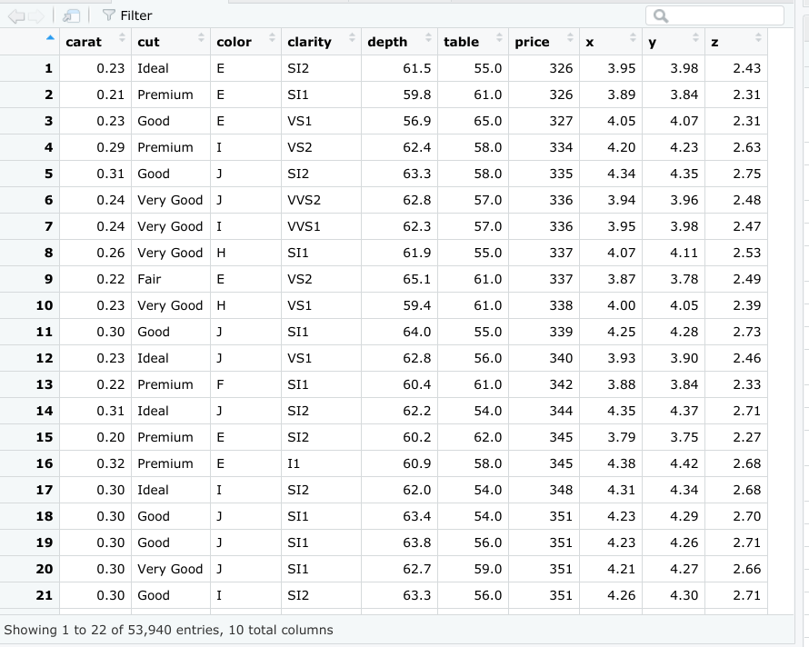
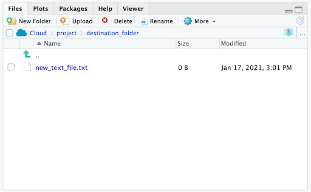
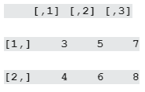
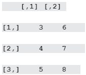

# Programar con RStudio

## Comprender los conceptos básicos de programación

En programación, una estructura de datos es un formato para organizar y almacenar datos. Es importante que conozcas las
estructuras de datos porque las usarás con frecuencia cuando utilices R para el análisis de datos. Las estructuras de
datos más comunes en el lenguaje de programación R incluyen:

### Vectores

Un vector es un grupo de elementos de datos del mismo tipo almacenado en una secuencia en R. No puedes tener un vector
que contenga valores lógicos y numéricos.

*Tipos de vectores:*

Existen dos tipos de vectores: vectores atómicos y listas. Luego, aprenderás sobre las propiedades básicas de los vectores
atómicos y las listas, y cómo utilizar el código R para crearlos.

Vectores atómicos

Primero, repasaremos los diferentes tipos de vectores atómicos. Luego, aprenderás cómo utilizar el código R para crear,
identificar y nombrar a los vectores.

Existen seis tipos primarios de vectores atómicos: lógicos, enteros, dobles, carácter (que contiene cadenas), complejos y
sin formato. Los dos últimos, complejo y sin formato, no son comunes en el análisis de datos, de modo que nos vamos a
concentrar en los primeros cuatro. Juntos, los vectores entero y doble son conocidos como vectores numéricos porque ambos
contienen números. Esta tabla resume los cuatro tipos primarios:

Este diagrama ilustra la jerarquía de relaciones entre estos cuatro tipos principales de vectores:

*Crear vectores:*

Una forma de crear un vector es utilizar la función c() (llamada función "combinar"). La función c() en R combina valores
múltiples en un vector. En R, esta función es solo la letra "c" seguida de los valores que deseas colocar en tu vector,
entre paréntesis, separados por una coma: c(x, y, z, …).

Por ejemplo, puedes utilizar la función c() para almacenar datos numéricos en un vector.

    v_1 <- c(2.5, 48.5, 101.5)

Para crear un vector de números enteros utilizando la función c(), debes colocar una "L" directamente después de cada número.

    v_2 <- c(1L, 5L, 15L)

También puedes crear un vector que contenga caracteres o valores lógicos.

    v_3 <- c(“Sara” , “Lisa” , “Anna”)

    v_4 <- c(TRUE, FALSE, TRUE)

*Determinar las propiedades de los vectores.*

Cada vector que creas tendrá dos propiedades clave: tipo y longitud.

Puedes determinar con qué tipo de vector estás trabajando mediante el uso de la función *typeof()*. Coloca el código para
el vector dentro del paréntesis de la función. Cuando ejecutes la función, R te dirá de qué tipo es. Por ejemplo:

    typeof(c(“a” , “b”))
    [1] "character"

Observa que el resultado de la función typeof en este ejemplo es la palabra “character”. Del mismo modo, si utilizas la
función typeof en un vector con valores enteros, el resultado va a incluir “integer”:

    typeof(c(1L , 3L))
    [1] "integer"

Puedes determinar la longitud de un vector existente, es decir, el número de elementos que contiene, utilizando la función
*length()*. En este ejemplo, podemos utilizar un operador de asignación para asignar al vector la variable x. Luego,
aplicamos la función length() a la variable. Cuando ejecutamos la función, R nos indica que la longitud es 3.

    x <- c(33.5, 57.75, 120.05)
    length(x)
    [1] 3

También puedes verificar si un vector es de un tipo específico mediante la función is:

    is.logical() is.double(), is.integer(), is.character()

En este ejemplo, R resulta TRUE porque el vector contiene valores enteros.

    x <- c(2L, 5L, 11L)
    is.integer(x)
    [1] TRUE

En este ejemplo, R arroja un valor de FALSE porque el vector no contiene caracteres, sino valores lógicos.

    y <- c(TRUE, TRUE, FALSE)
    is.character(y)
    [1] FALSE

*Nombrar vectores.*

Se puede poner nombre a todos los tipos de vectores. Los nombres son útiles para escribir códigos legibles y describir
objetos en R.

Puedes nombrar los elementos de un vector con la función *names()*. A modo de ejemplo, asignemos la variable x a un nuevo
vector con tres elementos.

    x <- c(1, 3, 5)

Puedes utilizar la función names() para asignar un nombre diferente a cada elemento del vector.

    names(x) <- c("a", "b", "c")

Ahora bien, cuando ejecutes el código, R mostrará que el primer elemento del vector se llama a, el segundo b, y el tercero c.

    x

    a b c

    1 3 5

Recuerda que un vector atómico solo puede contener elementos del mismo tipo. Si deseas almacenar elementos de diferentes
tipos en la misma estructura de datos, puedes utilizar una lista.

### listas

Las listas son diferentes de los vectores atómicos porque sus elementos pueden ser de cualquier tipo, por ejemplo,
fechas, marcos de datos, vectores, matrices y más. Las listas pueden también contener otras listas.

*Crear listas:*

Puedes crear una lista con la función list(). Del mismo modo que la función c(), la función *list()* es solo list seguida de
los valores que deseas colocar en tu lista entre paréntesis: list(x, y, z, …).

En este ejemplo, creamos una lista que contiene cuatro tipos de elementos diferentes: carácter ("a"), valor entero (1L),
doble (1.5),  y lógico (TRUE).

    list("a", 1L, 1.5, TRUE)

Como ya mencionamos, las listas pueden contener otras listas. Si lo deseas, puedes almacenar una lista dentro de otra y
continuar así.

    list(list(list(1 , 3, 5)))

*Determinar la estructura de las listas:*

Si deseas saber qué tipos de elementos contiene una lista, puedes utilizar la función *str()*. Para ello, coloca el código
para la lista dentro del paréntesis de la función. Cuando ejecutes la función, R mostrará la estructura de datos de la
lista mediante la descripción de sus elementos y tipos.

Apliquemos la función str() a nuestro primer ejemplo de una lista.

    str(list("a", 1L, 1.5, TRUE))

Cuando ejecutamos la función, R nos indica que la lista contiene cuatro tipos de elementos y que esos elementos son de
cuatro tipos diferentes: carácter (chr), entero (int), número (num) y lógico  (logi).

    List of 4

    $ : chr "a"

    $ : int 1

    $ : num 1.5

    $ : logi TRUE

Utilicemos la función str() para descubrir la estructura de nuestro segundo ejemplo.  Primero, asignemos la lista a la
variable z para facilitar la introducción de la función str().

    z <- list(list(list(1 , 3, 5)))

Vamos a ejecutar la función:

    str(z)

    List of 1

     $ :List of 1

      ..$ :List of 3

      .. ..$ : num 1

      .. ..$ : num 3

      .. ..$ : num 5

La sangría de los símbolos $ refleja la estructura anidada de esta lista. Bien, aquí hay tres niveles (de modo que hay
una lista dentro de otra lista).

*Poner nombre a las listas:*

A las listas, como a los vectores, se les puede colocar un nombre. Puedes nombrar los elementos de una lista cuando la
creas con la función list():

    list('nombre' - valor1, 'nombre' - valor2, 'nombre' - valor3)

    list('Chicago' = 1, 'New York' = 2, 'Los Angeles' = 3)

    $Chicago

    [1] 1

    $`New York`

    [1] 2

    $`Los Angeles`

    [1] 3

## Fechas y horas en R

*Cargar los paquetes tidyverse y lubridate:*

Antes de empezar a trabajar con fechas y horas, deberás cargar los paquetes tidyverse y lubridate. Lubridate es parte de tidyverse.

Primero, abre RStudio.
Si todavía no instalaste tidyverse, puedes utilizar la función install.packages () para ello:

    install.packages("tidyverse")

Luego, carga los paquetes tidyverse y lubridate utilizando la función library(). Primero, carga los componentes principales
de tidyverse para que estén disponibles en tu sesión actual de R:

    library(tidyverse)

Luego, carga el paquete lubridate:

    library(lubridate)

Ahora estás listo para conocer las herramientas en el paquete lubridate.

*Trabajar con fechas y horas:*

Tipos

En R, hay tres tipos de datos que hacen referencia a un instante en el tiempo:

    Una fecha ("2016-08-16")

    Una hora de un día (“20:11:59 UTC")

    fecha-hora. Esto es una fecha más una hora ("2018-03-31 18:15:48 UTC")

La hora se expresa en *UTC*, que quiere decir Hora Universal Coordinada, más comúnmente conocida como *tiempo civil*. Este
es el estándar principal que regula los relojes y la hora mundial.

Por ejemplo, para obtener la fecha actual puedes ejecutar la función *today()*. La fecha aparece como mes, año y día.

    today()

    [1] "2021-01-20"

Para obtener la fecha-hora actual puedes ejecutar la función *now()*. Observa que la hora aparece expresada hasta con los
segundos más cercanos.

    now()

    [1] "2021-01-20 16:25:05 UTC"

Al trabajar con R, hay tres modos posibles de crear formatos de fecha-hora:

    Desde una cadena

    Desde una fecha individual

    Desde un objeto de fecha/hora existente

R crea fechas en el formato estándar *yyyy-mm-dd (año-mes-día)* por defecto.

*Desde una cadena:*

Los datos de fecha/hora a menudo se expresan como cadenas. Puedes convertir cadenas en fechas y fecha-hora utilizando las
herramientas provistas por lubridate. Estas herramientas automáticamente trabajan sobre el formato de fecha/hora.

Primero, identifica el orden en el año, el mes y el día que aparecen en tus fechas. Luego, ordena las letras y, m y d (año,
mes y día) en el mismo orden. Eso te dará el nombre de la función lubridate que analizará tu fecha.

Por ejemplo, para la fecha 2021-01-20, utilizarás el orden ymd:

    ymd("2021-01-20")

Cuando ejecutes la función en R, el resultado para la fecha será el formato yyyy-mm-dd.

    [1] "2021-01-20"

Funciona de la misma forma en cualquier orden. Por ejemplo, mes, día y año. R arroja como resultado la fecha en el formato
yyyy-mm-dd.

    mdy("January 20th, 2021")

    [1] "2021-01-20"

O día, mes y año. R arroja como resultado la fecha en el formato yyyy-mm-dd.

    dmy("20-Jan-2021")

    [1] "2021-01-20"

Estas funciones también toman números que no están entre comillas y los convierte al formato yyyy-mm-yy.

    ymd(20210120)

    [1] "2021-01-20"

*Crear componentes de fecha-hora:*

La función ymd() y sus variantes crean fechas. Para crear una fecha-hora desde una fecha, agrega un guion bajo y una o
más de las letras h, m y s (horas, minutos y segundos) al nombre de la función:

    ymd_hms("2021-01-20 20:11:59")

    [1] "2021-01-20 20:11:59 UTC"

    mdy_hm("01/20/2021 08:01")

    [1] "2021-01-20 08:01:00 UTC"

*Optativo: Cambiar entre objetos existentes de fecha-hora:*

Cambiar entre una fecha-hora y una fecha.

Puedes utilizar la función as_date() para convertir una fecha-hora en una fecha. Por ejemplo, escribe la fecha-hora actual
en el paréntesis de la función now().

    as_date(now())

    [1] "2021-01-20"

*Desde una fecha individual:*

*Desde un objeto de fecha/hora existente:*

## Marcos de datos

Un marco de datos es un conjunto de columnas que contienen datos, que es similar a una hoja de cálculo o una tabla SQL.
Cada columna tiene un nombre en la parte superior que representa una variable e incluye una observación por fila. Los
marcos de datos ayudan a resumir los datos y ponerlos en un formato fácil de leer y usar.

Por ejemplo, el marco de datos más abajo muestra un conjunto de datos "diamonds", que es uno de los conjuntos de datos
precargados en R. Cada columna contiene una sola variable que se relaciona con los diamantes: quilate, corte, color, cla-
ridad, profundidad, etc. Cada fila representa una sola observación.

*Tener en cuenta cuando trabajas con marcos de datos:*

    Primero, se debe poner un nombre a las columnas.

    Segundo, los marcos de datos incluyen muchos tipos diferentes de datos, por ejemplo, números, valores lógicos o caracteres.

    Finalmente, los elementos en la misma columna deben ser de un mismo tipo.

crear un marco de datos en R, puedes utilizar la *función date.frame()*. La función data.frame() considera a los vectores
como entradas. En el paréntesis, escribe el nombre de la columna, seguido de un signo igual y, luego, el vector que deseas
escribir para esa columna.

En este ejemplo, la columna x es un vector con elementos 1, 2 y 3 y la columna y es un vector con elementos 1.5, 5.5, 7.5.

data.frame(x = c(1, 2, 3) , y = c(1.5, 5.5, 7.5))

Si ejecutas la función, R muestra el marco de datos en filas y columnas ordenadas.

       x y

    1  1 1.5

    2  2 5.5

    3  3 7.5

En la mayoría de los casos, no necesitarás crear un marco de datos manualmente ya que, en general, importarás los datos
desde otra fuente, por ejemplo, un archivo .csv, una base de datos relacional o un programa de software.

*Archivos:*

Veamos cómo crear, copiar y eliminar archivos en R. Para más información sobre cómo trabajar con archivos en R. La docu-
mentación en R es una herramienta que te facilitará encontrar y navegar por la documentación de casi todos los paquetes
de R en CRAN. Es una guía útil de referencia para funciones en código R. Veamos algunas otras de las funciones más útiles
para trabajar con archivos.

Utiliza *la función dir.create()* para crear una nueva carpeta o directorio, o para guardar tus archivos. Escribe el nombre
de la carpeta en el paréntesis de la función.

    dir.create ("destination_folder")

Utiliza *la función file.create()* para crear un archivo en blanco. Escribe el nombre y tipo de archivo entre paréntesis
en la función. En general, tus tipos de archivos serán .txt, .docx o .csv.

    file.create (“new_text_file.txt”)

    file.create (“new_word_file.docx”)

    file.create (“new_csv_file.csv”)

Si el archivo se crea exitosamente cuando ejecutas la función en R, el valor obtenido será TRUE (si no, R arrojará como
resultado FALSE).

    file.create (“new_csv_file.csv”)

    [1] TRUE

Se puede copiar un archivo mediante *la función file.copy()*. Entre paréntesis, agrega el nombre del archivo a copiar.
Luego, escribe una coma y agrega el nombre de la carpeta de destino a la que quieres copiar el archivo.

    file.copy (“new_text_file.txt” , “destination_folder”)

Si te fijas en el panel de Archivos en RStudio, aparece una copia del archivo en la carpeta correspondiente:

Referencias [http://statseducation.com/Introduction-to-R/modules/getting%20data/data-wrangling/]

## Matrices

Una matriz es un conjunto bidimensional de elementos de datos. Esto significa que tiene filas y columnas. Por el contrario,
un vector es una secuencia unidimensional de elementos de datos. Pero como los vectores, las matrices pueden solo contener
un único tipo de datos. Por ejemplo, no puedes tener tanto valores lógicos como numéricos en una matriz.

Para crear una matriz en R, puedes utilizar la función matrix(). La función matrix() tiene dos argumentos principales que
debes escribir dentro del paréntesis. Primero, agrega un vector. El vector contiene los valores que quieres colocar en la
matriz. Luego, agrega al menos una dimensión de matriz. Puedes elegir especificar el número de filas o columnas utilizando
el código nrow = para las filas o ncol =. para las columnas.

Por ejemplo, imagina que quieres crear una matriz de 2x3 (dos filas por tres columnas) que contenga los valores 3-8. Pri-
mero, escribe un vector que contenga la serie de números: c(3:8). Luego, escribe una coma. Al finalizar, escribe nrow = 2
para especificar el número de filas.

    matrix(c(3:8), nrow = 2)

Si ejecutas la función, R muestra una matriz con tres columnas y dos filas (a las que, en general, nos referimos como "2x3")
que contienen los valores numéricos 3, 4, 5, 6, 7, 8. R coloca el primer valor (3) del vector en la fila superior y la
fila de la izquierda de la matriz, y continúa la secuencia de izquierda a derecha.

    

También puedes elegir especificar el número de columnas (ncol = ) en lugar del número de filas  (nrow = ).

    matrix(c(3:8), ncol = 2)

Cuando ejecutes la función, R intuirá automáticamente cuál es el número de filas.

    

Rangos
