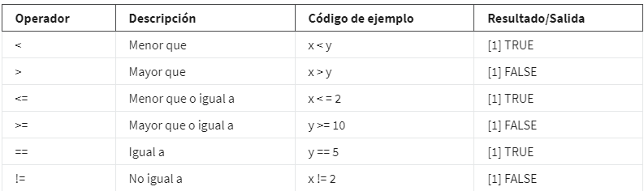
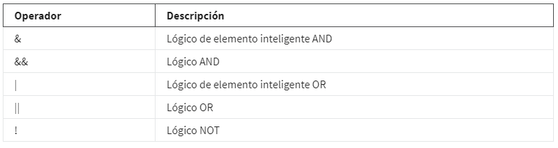
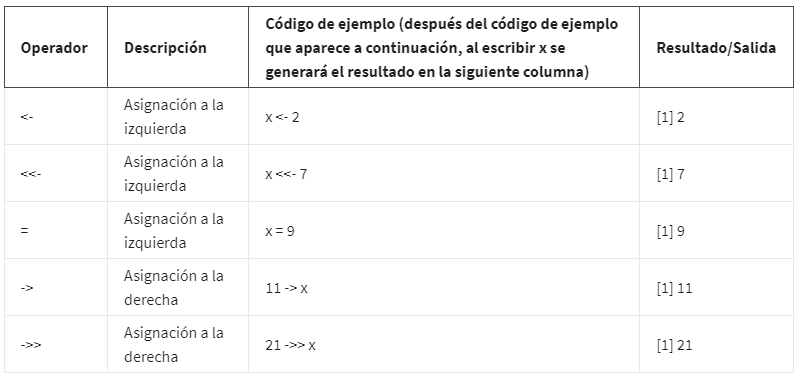

# Explora la codificación en R

## Operaciones y cálculos

Los operadores, los definimos como un símbolo que designa el tipo de operación o cálculo a realizar en una fórmula.
Los operadores de asignación se usan para asignar valores a las variables y los vectores.

    sales_1 <- c(75.9, 96.55, 45.74, 65.23)

Los operadores aritméticos. Estos operadores se usan para completar cálculos matemáticos y podrían parecer familiares. Los
signos más(+) hacen sumas en las variables, y los signos menos(-) hacen restas. Usamos un asterisco(*) para hacer multiplica-
ciones y una barra inclinada(/) para hacer una división.

    x <- 1
    y <- 2
    z <- x + y
    [1] 3

## Más información sobre los operadores de R

Operadores en R, hay cuatro tipos principales de operadores:

    Aritméticos

    Relacionales

    Lógicos

    De asignación

### Operadores aritméticos

Los operadores aritméticos te permiten realizar operaciones matemáticas básicas como suma, resta, multiplicación y división.

La siguiente tabla resume los diferentes operadores aritméticos en R. Los ejemplos usados en la tabla se basan en la
creación de dos variables: : x es igual a 2 e y es igual a 5. Ten en cuenta que usas el operador de asignación para alma-
cenar estos valores:

    x <- 2

    y <- 5

### Operadores relacionales

Los operadores relacionales, también conocidos como comparadores, permiten comparar valores. Los operadores relacionales
identifican cómo se relaciona un objeto R con otro, por ejemplo, si un objeto es menor, igual o mayor que otro. El re-
sultado de los operadores relacionales es TRUE o FALSE (que es un tipo de dato lógico o booleano).

La tabla a continuación resume los seis operadores relacionales en R. Los ejemplos usados en la tabla se basan en la crea-
ción de dos variables: : x es igual a 2 e y es igual a 5. Ten en cuenta que usas el operador de asignación para almacenar
estos valores.

    x <- 2

    y <- 5

Si se realizan cálculos con cada operador, se obtienen los siguientes resultados. En este caso, el archivo de salida es
booleano: TRUE o FALSE. Ten en cuenta que el [1] que aparece antes de cada resultado se usa para representar cómo se mues-
tra el resultado en RStudio

### Operadores lógicos e instrucciones condicionales

Los operadores lógicos te permiten combinar valores lógicos. Los operadores lógicos arrojan un tipo de dato lógico o
booleano (TRUE o FALSE). Ya viste los operadores lógicos en una lectura anterior,

La siguiente tabla resume los operadores lógicos en R:

Los operadores lógicos arrojan un tipo de dato lógico, cuyo valor de salida es TRUE o FALSE, con los cual entendemos que
solo tiene dos valores posibles, Existen tres tipos principales de operadores lógicos:

AND (algunas veces representado como & o && en R)

OR (algunas veces representado como | o || en R)

NOT (!)

#### El operador AND (“&”)

El operador AND requiere de dos valores lógicos. El resultado es  TRUE si cada uno de los valores por separado es TRUE.
Esto significa que TRUE & TRUE dan como resultado  TRUE. Sin embargo, FALSE & TRUE, TRUE & FALSE y FALSE & FALSE arrojan
como resultado FALSE.

Si ejecutas el código correspondiente en R, obtienes los siguientes resultados

    > TRUE & TRUE
    [1] TRUE
    > TRUE & FALSE
    [1] FALSE
    > FALSE & TRUE
    [1] FALSE
    > FALSE & FALSE
    [1] FALSE

Es posible ilustrar esto mediante el uso de los resultados de nuestras comparaciones. Imagina que creas una variable x
que es igual a 10.

    x <- 10

Para revisar si x es mayor que 3 pero menor que 12, puedes utilizar

    x > 3 & x < 12

Cuando ejecutas la función, R arroja el resultado TRUE.

    [1] TRUE

TRUE La primera parte,  x > 3 dará como resultado  TRUE  ya que 10 es mayor que 3. La segunda parte, x < 12  también dará
como resultado TRUE a que 10 es menor que 12. Como ambos valores dan TRUE, el resultado de la expresión AND es TRUE. El
número 10 se ubica entre los números 3 y 12.

Sin embargo, si x es igual a 20, la expresión x > 3 & x < 12 arrojará un resultado diferente.

    x <- 20
    x > 3 & x < 12
    [1] FALSE

 Aunque x > 3 es TRUE (20 > 3), x < 12 es FALSE (20 < 12). entonces, toda la expresión dará como resultado FALSE (TRUE
 & FALSE = FALSE). De modo que el resultado de R será FALSE.

#### Operador OR (“|”)

El operador OR (|) trabaja de un modo similar el operador AND (&). La diferencia principal consiste en que, al menos,
uno de los valores de la operación OR deber ser TRUE para que toda la operación OR dé como resultado TRUE. Sin embargo,
TRUE | TRUE, TRUE | FALSE, y FALSE | TRUE arrojan como resultado TRUE. Cuando ambos valores dan FALSE, el resultado es FALSE.

Si escribes el código, obtienes los siguientes resultados:

    > TRUE | TRUE
    [1] TRUE
    > TRUE | FALSE
    [1] TRUE
    > FALSE | TRUE
    [1] TRUE
    > FALSE | FALSE
    [1] FALSE

Por ejemplo, supón que creaste una variable y igual a 7. Para revisar si y es menor que 8 o mayor que 16, puedes utilizar
la siguiente expresión:

    y <- 7
    y < 8 | y > 16

El resultado comparativo es TRUE (7 es menor que 8) | FALSE (7 no es mayor que 16). Ya que un solo valor de una expresión
OR debe ser TRUE para que toda la expresión sea TRUE, R arroja como resultado TRUE.

    [1] TRUE

Ahora, imagina que y es 12. La expresión y < 8 | y > 16 ahora da FALSE (12 < 8) | FALSE (12 > 16). Ambas comparaciones
dan como resultado FALSE, de modo que es resultado es  FALSE.

    y <- 12
    y < 8 | y > 16
    [1] FALSE

#### El operador NOT (“!”)

El operador NOT (!) simplemente niega el valor lógico al que se aplica. En otras palabras, !TRUE da FALSE y !FALSE da TRUE.

Cuando ejecutas el código, obtienes lo siguiente:

    > !TRUE
    [1] FALSE
    > !FALSE
    [1] TRUE

Igual que en el caso de los operadores OR y AND, puedes utilizar el operador NOT en combinación con los operadores lógicos.
Cero se considera FALSE y los números que no son cero se consideran TRUE. El operador NOT da como resultado el valor lógico
opuesto.

Imagina que tienes una variable x que es igual a 2:

    x <- 2

El operador NOT da como resultado FALSE porque toma el valor lógico opuesto de un número que no es cero (TRUE).

    > !x
    [1] FALSE

#### Operadores de asignación

Los operadores de asignación te permiten asignar valores a las variables.

En muchos lenguajes de programación de secuencias de comandos se puede usar simplemente el signo igual (=) para asignar
una variable. Para R, la mejor práctica es usar la asignación de flechas (<-). Técnicamente, la asignación de una flecha
se puede usar en la dirección izquierda o derecha. Sin embargo, la asignación hacia la derecha no se utiliza generalmente
en código R.

También se puede usar la asignación de doble flecha, conocida como asignación de alcance. Pero la asignación de alcance
es para usuarios avanzados de R, así que no la aprenderás en esta lectura.

La tabla a continuación resume los operadores de asignación y el código de ejemplo en R. Observa que el resultado de cada
variable es su valor asignado.

## Instrucciones condicionales

Una *instrucción condicional* es una declaración de que si una determinada condición se mantiene, entonces, debe producirse
un determinado evento. Por ejemplo, "Si la temperatura está por encima del punto de congelamiento, entonces, saldré a
caminar". Si la primera condición es verdadera (la temperatura está por encima del punto de congelamiento), entonces la
segunda condición sucederá (salir a caminar). Las instrucciones condicionales en código R tienen una lógica similar.

Veamos ahora cómo crear instrucciones condicionales en R utilizando tres instrucciones relacionadas:

### if()

La instrucción if establece una condición y si la condición arroja como resultado TRUE, el código R asociado a la ins-
trucción if se ejecuta.

    Sintaxis: if (condition) { expr si se cumple la condicion }

Por ejemplo, creemos una variable x igual a 4.

    x <- 4

Luego, creemos una instrucción condicional: si x es mayor que 0, entonces R imprimirá la cadena "x es un número positivo".

    if (x > 0) {

    print("x is a positive number")

    }

Dado que x=4, la condición es verdadera (4 > 0). Por lo tanto, cuando ejecutas el código, R imprime la cadena "x es un
número positivo".

    [1] "x is a positive number"

Pero si cambias x a un número negativo, como -4, entonces, el resultado de la condición será FALSE (-4 > 0). Si ejecutas
el código, R no ejecutará el código impreso. En su lugar, aparecerá una línea en blanco.

### else()

La instrucción else se utiliza en combinación con una instrucción if. Así se estructura el código en R:

    Sintaxis: if (condition) { expr1 si se cumple la condicion} else { expr2 si falla o no se cumple la codicion }

Por ejemplo. Primero creemos una variable x igual a 7.

    x <- 7

Ahora, establezcamos las siguientes condiciones:

    - Si x es mayor que 0, R imprimirá "x es un número positivo".

    - Si x es menor que o igual a 0, R imprimirá "x es un número negativo o cero".

En nuestro código, la primera condición (x > 0) será parte de la instrucción if. La segunda condición de x menor que o
igual a 0 queda implícita en la instrucción else. Si x > 0, R imprimirá "x es un número positivo". De otro modo, R impri-
mirá "x es un número negativo o cero".

    x <- 7

    if (x > 0) {

    print ("x is a positive number")

    } else {

    print ("x is either a negative number or zero")

    }

Dado que 7 es mayor que 0, la condición de la instrucción if es verdadera. Por lo tanto, cuando ejecutas el código, R
imprime "x es un número positivo".

    [1] "x is a positive number"

Pero si haces que x sea igual a -7, la condición de la instrucción if no será verdadera (-7 no es mayor que 0). Por lo
tanto, R ejecutará el código en la instrucción else. Cuando ejecutas el código, R imprime "x es un número negativo o cero".

    x <- -7

    if (x > 0) {

    print("x is a positive number")

    } else {

    print ("x is either a negative number or zero")

    }

    [1] "x is either a negative number or zero"

### else if()

Permite evaluar una codicion adicional en caso de que falle el if() inicial y una nueva codicion pueda ser evaluada.

Sintaxis:

    if (condition1) {

    expr1

    } else if (condition2) {

    expr2

    } else {

    expr3

    }

ejemplo:

Primero creemos una variable x igual a 1 negativo ("-1").

    x <- -1

Ahora, quieres establecer las siguientes condiciones:

    Si x es menor que 0, imprimir "x es un número negativo".

    Si x es igual a 0, imprimir " x es cero".

    De otro modo, imprimir "x es un número positivo".

En el código, la primera condición será parte de la instrucción if, la segunda condición será parte de la instrucción else
if y la tercera condición será parte de la instrucción else. Si x < 0, R imprimirá "x es un número negativo". Si x = 0,
R imprimirá "x es cero". De otro modo, R imprimirá "x es un número positivo".

    x <- -1

    if (x < 0) {

    print("x es un número negativo")

    } else if (x == 0) {

    print("x es cero")

    } else {

    print("x es un número positivo")

    }

Como -1 es menor que 0, la condición de la instrucción if resulta TRUE y R imprime "x es un número negativo".

    [1] "x es un número negativo"

Si haces que x sea igual a 0, R comprobará primero la condición if (x < 0) y determinará que es FALSE. Entonces, R eva-
luará la condición else if. Esta condición, x==0, es TRUE. Por ello, en este caso R imprimirá "x es cero".

Si haces que x sea igual a 1, ambas condiciones, if y else, arrojarán como resultado FALSE. De modo que R ejecutará la
instrucción else e imprimirá "x es un número positivo".

Tan pronto como R descubre una condición que resulta TRUE, R ejecuta el código correspondiente e ignora el resto.

*---------Aprende acerca de los paquetes R---------------.*

## Paquetes R disponibles

CRAN web que almacena los paquetes y repositorios pertenecientes a R, es el mas usado [https://cran.r-project.org/], aunque
tambien github puede ser usado y cualquier otro sistema de control de versioens.

Los paquetes son unidades de código R reproducible y hacen que sea más fácil hacer un seguimiento del código. Fueron
creados por miembros de la comunidad R para hacer un seguimiento de las funciones R que ellos escriben y vuelven a usar.
Estos miembros de la comunidad podrían poner los paquetes a disposición de otros usuarios.

Los paquetes en R incluyen funciones en R reutilizables y documentación sobre las funciones, incluido cómo usarlas. También
contienen muestras de conjuntos de datos y pruebas para verificar tu código para asegurarte de que hace lo que quieres
que haga. Por defecto, R incluye un conjunto de paquetes denominados Base R que están disponibles para su uso en RStudio
cuando empiezas tu primera sesión de programación

## Ejemplos de paquetes y sus usos

[https://www.tidyverse.org/] -> La colección de tidyverse de paquetes de R está diseñada especialmente para trabajar con
datos. Es una biblioteca estándar para la mayoría de los analistas de datos, pero también puedes descargar los paquetes
en forma individual.

Tidyverse es, en realidad, una colección de paquetes en R con una filosofía de diseño común para la manipulación, explo-
ración y visualización de datos. Usar tidyverse puede ayudarte a trabajar a tu manera durante gran parte de todo el pro-
ceso de análisis de datos.

[https://support.rstudio.com/hc/en-us/articles/201057987-Quick-list-of-useful-R-packages] -> Esta es la lista de apoyo
de RStudio donde encontrarás paquetes útiles con instrucciones de instalación y la descripción de su funcionalidad.

[https://cran.r-project.org/web/views/] -> Este es un índice de los paquetes CRAN ordenados por tarea. Puedes buscar el
tipo de tarea que necesitas realizar y te traerá una página con paquetes relacionados con la tarea para que explores.

## tidyverse

El nucleo de paquetes de tidyverse son los siguientes: ggplot2, tidyr, readr, dplyr, tibble, purrr, stringr y forcats.

### tibble

    Tibble trabaja con marcos de datos.

### purrr

    Purrr trabaja con funciones y vectores que ayudan a que tu código sea más fácil de escribir y más expresivo.

### stringr

    Stringr incluye funciones que hacen que sea más fácil trabajar con cadenas.

### forcats

    Forcats proporciona herramientas que resuelven problemas comunes con factores.

*los factores almacenan datos categóricos en R donde los valores de datos están limitados y generalmente se basan en un*
*grupo finito como país o año.*

Pero, hay cuatro de estos paquetes que son una parte esencial del flujo de trabajo para los analistas de datos:

### ggplot2

    Ggplot2 se usa para visualización de datos, especialmente diagramas. Con ggplot2, puedes crear una variedad de vi-
    sualización de datos al aplicar propiedades visuales diferentes a las variables de datos.

### dplyr

    Dplyr ofrece un conjunto consistente de funciones que te ayudan a completar algunas tareas comunes de manipulación
    de datos. Por ejemplo, la función select, escoge variables según sus nombres, y la función filter encuentra casos
    donde determinadas condiciones son ciertas.

### tidyr

    Tidyr es un paquete que se usa para limpieza de datos para generar datos ordenados. Cubrimos datos ordenados o limpios
    anteriormente, pero, a modo de recordatorio, son datos donde cada parte de la tabla de datos o marco de datos es del
    tipo correcto en el lugar correcto. Tidyr funciona con datos en formato ancho y datos en formato largo para asegurarse
    de que esto funciona.

### readr

    readr, que se usa para importar datos. La función más común de readr es read_csv. Esto importará un archivo CSV en R.
    Un archivo CSV contiene datos separados por comas en un formato de tablas. Para leer correctamente un conjunto de datos
    con readr, combinas la función con una especificación de columna. La especificación de columna describe cómo debería
    cada columna convertirse en el tipo de datos más apropiado. Es bueno tener en cuenta que, en general, esto no es ne-
    cesario porque readr lo averiguaría por ti automáticamente.

## Pipes

Los pipes son una herramienta en R para expresar una secuencia de varias operaciones. En otras palabras, toma el resultado
de una instrucción y lo convierte en la entrada de la siguiente instrucción. En lugar de escribir funciones dentro de otras
funciones, podrías usar el operador pipe para hacer el mismo trabajo, por lo tanto su objetivo principal objetivo es ayudar
a hacer que tu código sea más eficiente y más fácil de leer y comprender.

En programación, decimos que está anidado. Anidado describe código que realiza una función particular y está incluido dentro
del código que realiza una función más amplia. Puedes pensar en un pipe como una manera de codificar la frase.

    *Para cargar cualquier conjunto de datos ya instalados usamos la funcion data("Nombre del dataset").*
    *para visualizar el dataset utilizamos la funcion View(), notece que la V es mayuscula y no lleva "" en el nobre del dataset*

*Tener en cuenta.*

Primero, es importante agregar el operador de canalización al final de cada línea de la operación canalizada, excepto la última.

Segundo verificar tu código una vez que programaste tu canalización. Recuerda, RStudio agrega automáticamente las sangrías a las
líneas de código que son parte de una canalización. Si una línea en tu código no tiene sangrías, probablemente no fue agregada a
la canalización. Eso podría llevar a un error de instrucción. Luego, puedes revisar la operación canalizada para verificar partes
de tu código a corregir.
