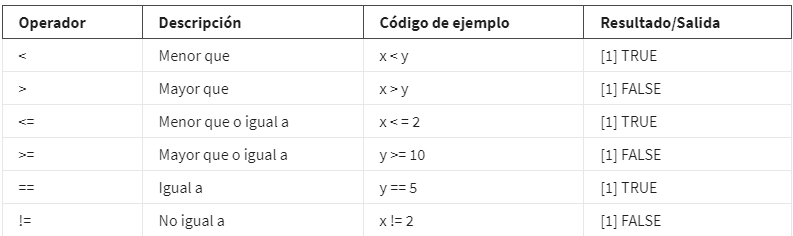
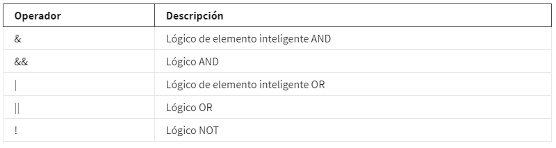

# Datos en R

## DataFrame en R

un marco de datos(*Data frame*). Un marco de datos es un conjunto de columnas. Se parece mucho a una hoja de cálculo o una
tabla de SQL.

Usamos los marcos de datos(data Frame) para muchas de las mismas razones por las que usamos las tablas. Ayudan a resumir los datos y
ponerlos en un formato que sea fácil de leer y usar.

### Caracteristicas de los Data frame

Primero, se debe asignar un nombre a las columnas. Usar columnas sin nombre puede ocasionar problemas con los resultados más adelante.

Los datos almacenados en tu marco de datos pueden ser de diferentes tipos, por ejemplo, números, factores o caracteres. Los marcos de
datos suelen contener fechas, marcas de tiempo y vectores lógicos.

Cada columna debe contener el mismo número de elementos de datos, aún si faltan algunos de esos elementos de datos.

### Trabajar con marcos de datos

Para trabajo introductorio con data frames, cargamos el visualizador de datos el cual es una libraria de tidyverse, en este
caso GGplot2, con la funcion

    *library(ggplot2)*,

teniendo tidyverse previamente instalado y cargado, posterior para usar el data frame, usariamos la funcion

    *data(diamonds)*, notese que usamos el data frame "diamonds",

posteriormente lo agregamos al visor de datos, con la funcion

    *view(diamonds)*

Con la funcion head() obtenemos los primeros 10 registros del data frame y asi verificamos que este en buenas ocndiciones
y el data frame a utilizar

    head(dimonds)

Con funciones como str() obtenemos informacion del data frame como nombres de las columnas, tipos de datos de cada una,
ejemplo de los datos que almacenan, etc

    head(diamonds)

Con funciones como colnames() es posible obtener los nombres de las columnas del data frame, lo cual nos permite dar un vistaso
rapido a la organiozacin del mismo

    colnames(diamonds)

La funcion mutate() forma parte del paquete dplyr sujeto a tidyverse, mutate requiere dos datos basicos, el nombre del
data set a cambiar y lo que se desea cambiar, por ejemplo si agragamos una columna adicional al data set diamonds seria:

    mutate(diamonds, carat_2=carat*100)

las funcion anterior agrega una columna calculada con base en una columna previa.

### Tibbles

En tidyverse, los tibbles son marcos de datos optimizados. Facilitan el manejo con los datos, pero difieren un poco de los marcos
de datos estándar.

Los tibbles difieren un poco de los marcos de datos estándar. Un marco de datos es un conjunto de columnas, como una hoja de cálculo
o una tabla SQL. Los tibbles son como marcos de datos simplificados que se configuran automáticamente para mostrar solo las 10 primeras
filas de un conjunto de datos, y solo tantas columnas como puedan caber en la pantalla.

Son muy útiles cuando estás trabajando con grandes conjuntos de datos.

#### Tibbles VS Data frame estandars

Nunca cambian los tipos de datos de las entradas, ni los nombres de las variables. No cambiarán tus cadenas a factores ni a ninguna
otra cosa. Puedes hacer más cambios que en los marcos de datos básicos.

Son más fáciles de usar. Esto ahorra tiempo porque ya no tendrás que hacer tanta limpieza o cambiar los tipos de datos en tibbles. Además,
los tibbles nunca cambian los nombres de tus variables, y nunca crean nombres de filas.

los tibbles facilitan la impresión en R. No sobrecargarán accidentalmente tu consola porque están configurados en forma automática para
extraer solo las primeras 10 filas y tantas columnas como quepan en la pantalla. Son muy útiles cuando estás trabajando con grandes
conjuntos de datos.

#### Creación de tibbles

Puedes cargar el conjunto de datos con la función data() usando el siguiente código:

    library(tidyverse)

    data(diamonds)

A continuación, vamos a agregar el marco de datos a nuestro visor de datos en RStudio con la función View().

    View(diamonds)

para crear un tibble a partir de datos existentes con la función as_tibble(). Indica los datos que deseas usar en el pa-
réntesis de la función.

    as_tibble(diamonds)

En la salida obtendriamos solo los primeros 10 registros del data set diamonds

