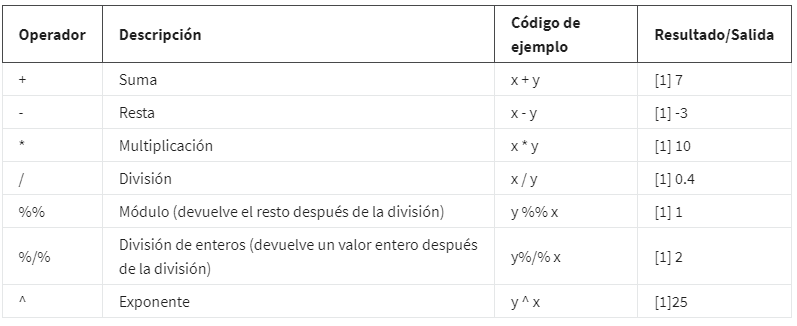

# Datos en R

## DataFrame en R

un marco de datos(*Data frame*). Un marco de datos es un conjunto de columnas. Se parece mucho a una hoja de cálculo o una
tabla de SQL.

Usamos los marcos de datos(data Frame) para muchas de las mismas razones por las que usamos las tablas. Ayudan a resumir los datos y
ponerlos en un formato que sea fácil de leer y usar.

### Caracteristicas de los Data frame

Primero, se debe asignar un nombre a las columnas. Usar columnas sin nombre puede ocasionar problemas con los resultados más adelante.

Los datos almacenados en tu marco de datos pueden ser de diferentes tipos, por ejemplo, números, factores o caracteres. Los marcos de
datos suelen contener fechas, marcas de tiempo y vectores lógicos.

Cada columna debe contener el mismo número de elementos de datos, aún si faltan algunos de esos elementos de datos.

### Tibbles

En tidyverse, los tibbles son como marcos de datos optimizados. Facilitan el manejo con los datos, pero difieren un poco de los marcos
de datos estándar.

*Tibbles VS Data frame estandars.*

Nunca cambian los tipos de datos de las entradas. No cambiarán tus cadenas a factores ni a ninguna otra cosa. Puedes hacer más cambios que
en los marcos de datos básicos.

Son más fáciles de usar. Esto ahorra tiempo porque ya no tendrás que hacer tanta limpieza o cambiar los tipos de datos en tibbles. Además,
los tibbles nunca cambian los nombres de tus variables, y nunca crean nombres de filas.

los tibbles facilitan la impresión en R. No sobrecargarán accidentalmente tu consola porque están configurados en forma automática para
extraer solo las primeras 10 filas y tantas columnas como quepan en la pantalla. Son muy útiles cuando estás trabajando con grandes
conjuntos de datos.

