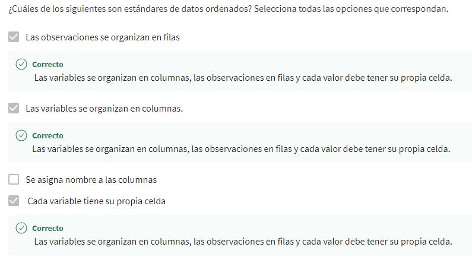
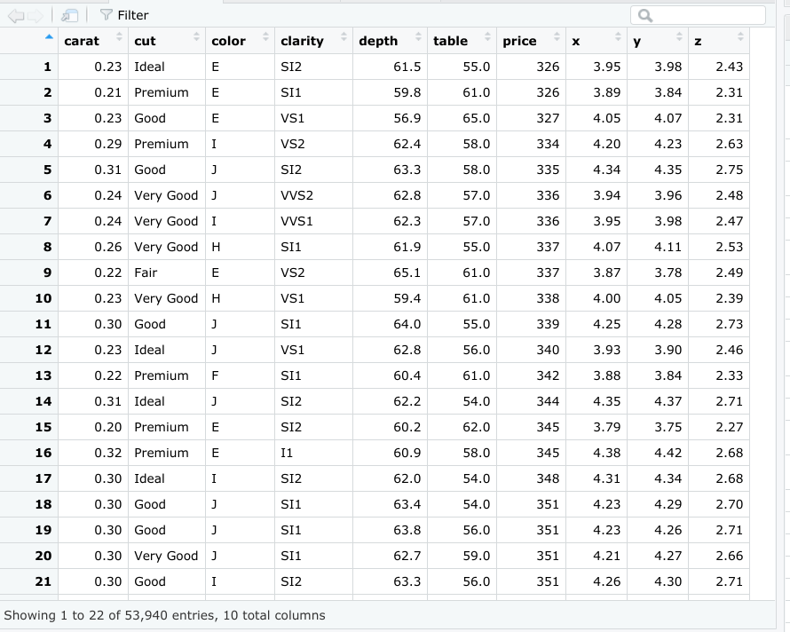
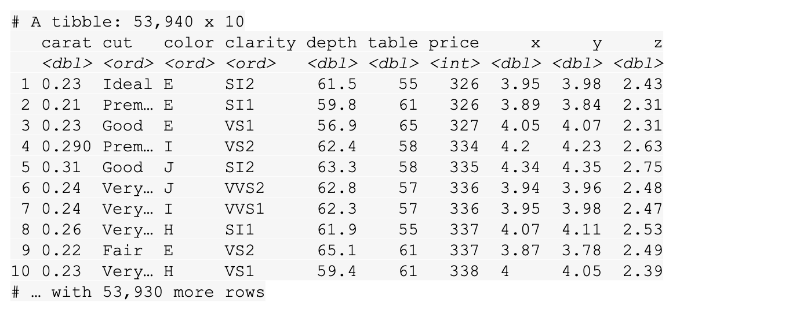
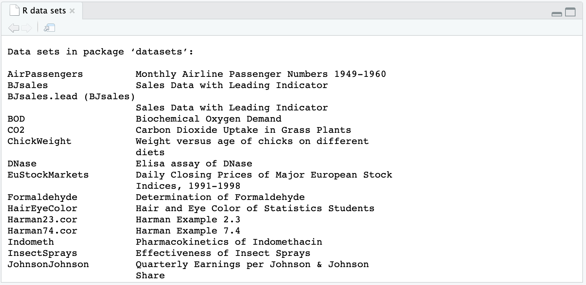
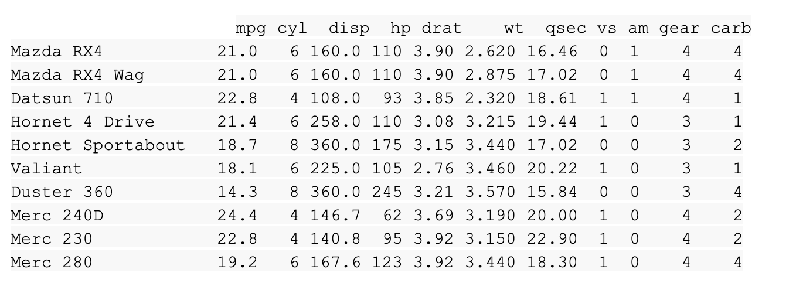
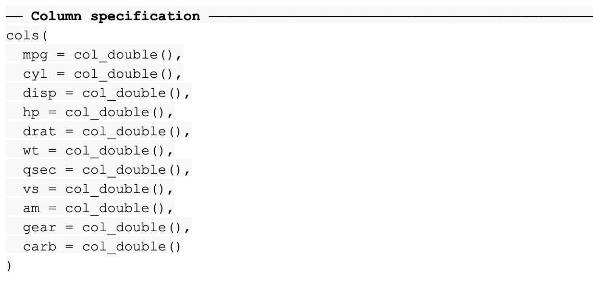
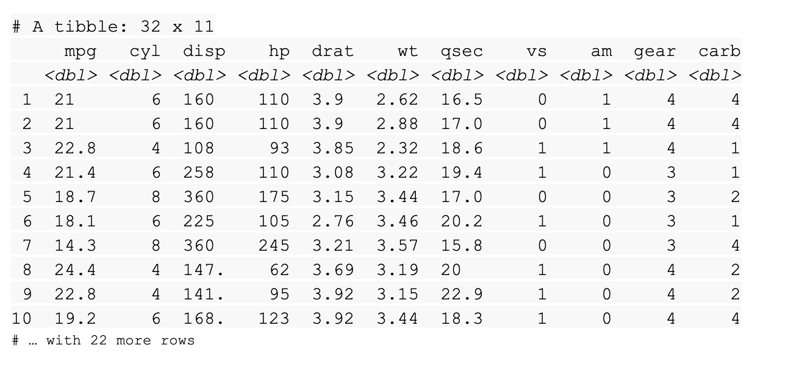
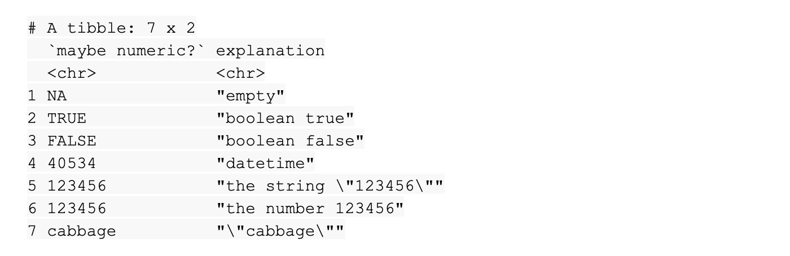

# Datos en R

## DataFrame en R

un marco de datos(*Data frame*). Un marco de datos es un conjunto de columnas. Se parece mucho a una hoja de cálculo o una
tabla de SQL.

Usamos los marcos de datos(data Frame) para muchas de las mismas razones por las que usamos las tablas. Ayudan a resumir los datos y
ponerlos en un formato que sea fácil de leer y usar.

### Caracteristicas de los Data frame

Primero, se debe asignar un nombre a las columnas. Usar columnas sin nombre puede ocasionar problemas con los resultados más adelante.

Los datos almacenados en tu marco de datos pueden ser de diferentes tipos, por ejemplo, números, factores o caracteres. Los marcos de
datos suelen contener fechas, marcas de tiempo y vectores lógicos.

Cada columna debe contener el mismo número de elementos de datos, aún si faltan algunos de esos elementos de datos.

### Trabajar con marcos de datos

Para trabajo introductorio con data frames, cargamos el visualizador de datos el cual es una libraria de tidyverse, en este
caso GGplot2, con la funcion

    *library(ggplot2)*,

teniendo tidyverse previamente instalado y cargado, posterior para usar el data frame, usariamos la funcion

    *data(diamonds)*, notese que usamos el data frame "diamonds",

posteriormente lo agregamos al visor de datos, con la funcion

    *view(diamonds)*

Con la funcion head() obtenemos los primeros 10 registros del data frame y asi verificamos que este en buenas ocndiciones
y el data frame a utilizar

    head(dimonds)

Con funciones como str() obtenemos informacion del data frame como nombres de las columnas, tipos de datos de cada una,
ejemplo de los datos que almacenan, etc

    head(diamonds)

Con funciones como colnames() es posible obtener los nombres de las columnas del data frame, lo cual nos permite dar un vistaso
rapido a la organiozacin del mismo

    colnames(diamonds)

La funcion mutate() forma parte del paquete dplyr sujeto a tidyverse, mutate requiere dos datos basicos, el nombre del
data set a cambiar y lo que se desea cambiar, por ejemplo si agragamos una columna adicional al data set diamonds seria:

    mutate(diamonds, carat_2=carat*100)

las funcion anterior agrega una columna calculada con base en una columna previa.

### Tibbles

En tidyverse, los tibbles son marcos de datos optimizados. Facilitan el manejo con los datos, pero difieren un poco de los marcos
de datos estándar.

Los tibbles difieren un poco de los marcos de datos estándar. Un marco de datos es un conjunto de columnas, como una hoja de cálculo
o una tabla SQL. Los tibbles son como marcos de datos simplificados que se configuran automáticamente para mostrar solo las 10 primeras
filas de un conjunto de datos, y solo tantas columnas como puedan caber en la pantalla.

Son muy útiles cuando estás trabajando con grandes conjuntos de datos.

#### Tibbles VS Data frame estandars

Nunca cambian los tipos de datos de las entradas, ni los nombres de las variables. No cambiarán tus cadenas a factores ni a ninguna
otra cosa. Puedes hacer más cambios que en los marcos de datos básicos.

Son más fáciles de usar. Esto ahorra tiempo porque ya no tendrás que hacer tanta limpieza o cambiar los tipos de datos en tibbles. Además,
los tibbles nunca cambian los nombres de tus variables, y nunca crean nombres de filas.

los tibbles facilitan la impresión en R. No sobrecargarán accidentalmente tu consola porque están configurados en forma automática para
extraer solo las primeras 10 filas y tantas columnas como quepan en la pantalla. Son muy útiles cuando estás trabajando con grandes
conjuntos de datos.

#### Creación de tibbles

Puedes cargar el conjunto de datos con la función data() usando el siguiente código:

    library(tidyverse)

    data(diamonds)

A continuación, vamos a agregar el marco de datos a nuestro visor de datos en RStudio con la función View().

    View(diamonds)

para crear un tibble a partir de datos existentes con la función as_tibble(). Indica los datos que deseas usar en el pa-
réntesis de la función.

    as_tibble(diamonds)

En la salida obtendriamos solo los primeros 10 registros del data set diamonds

## Conceptos básicos de la importación de datos

### funcion data()

Usar la función data() para cargar estos conjuntos de datos en R. Si ejecutas la función data sin un argumento, R mostrará
una lista de los conjuntos de datos disponibles.

    data()

cuya salida mortraia algo similar a lo siguiente

Para cargar un conjunto de datos específico, solo tienes que introducir su nombre en el paréntesis de la función data().
por ejemplo:

    data(mtcars)

puedes obtener una vista previa del mismo en el panel de la consola de R. Solo tienes que escribir su nombre...

    mtcars

cuya salida mortraia algo similar a lo siguiente

También puedes ver el conjunto de datos haciendo clic directamente sobre el nombre del conjunto de datos en el panel
Entorno. Así, si haces clic en mtcars en el panel Entorno, R ejecuta automáticamente la función View() y muestra el con-
junto de datos en el visor de datos de RStudio.

## El paquete readr

El paquete readr en R es una excelente herramienta para leer datos rectangulares. Los datos rectangulares son datos que
encajan perfectamente en un rectángulo de filas y columnas, en el que cada columna se refiere a una única variable y cada
fila a una única observación.

Estos son algunos ejemplos de tipos de archivos que almacenan datos rectangulares:

*.csv (valores separados por comas)*: Un archivo .csv es un archivo de texto sin formato que contiene una lista de datos.
La mayoría de las veces usan comas para separar (o delimitar) los datos, pero a veces utilizan otros caracteres, como el
punto y coma.

*.tsv (valores separados por tabulaciones):* Un archivo .tsv almacena una tabla de datos en la que las columnas de datos
están separadas por tabulaciones. Por ejemplo, una tabla de una base de datos o datos de una hoja de cálculo.

*.fwf (archivos de ancho fijo):* Un archivo .fwf tiene un formato específico que permite guardar datos textuales de forma
organizada.

*.log:* Un archivo .log es un archivo generado por computadora que registra eventos de sistemas operativos y otros pro-
gramas de software.

Base R también tiene funciones para leer archivos, pero las funciones equivalentes en readr suelen ser mucho más rápidas,
Además, producen tibbles, que son fáciles de usar y leer.

El paquete readr forma parte del núcleo de tidyverse. Así que, si ya instalaste tidyverse, tienes lo que necesitas para
empezar a trabajar con readr. Si no lo has hecho, puedes instalar tidyverse ahora.

### Funciones readr

El objetivo de readr es proporcionar una forma rápida y amigable de leer datos rectangulares. La función readr soporta
varias funciones read_ . Cada función se refiere a un formato específico de archivo.

    read_csv(): Archivos de valores separados por comas (.csv)

    read_tsv(): Archivos de valores separados por tabuladores

    read_delim(): Archivos delimitados en general

    read_fwf(): Archivos de ancho fijo

    read_table(): Archivos tabulares cuyas columnas están separadas por espacios en blanco

    read_log(): Archivos de registro de la web

*Leer un archivo csv con readr.*

El paquete readr viene con algunos archivos de muestra de conjuntos de datos integrados que puedes usar para el código
de ejemplo. Para enumerar los archivos de muestra, puedes ejecutar la función readr_example() sin argumentos.

    readr_example()

    [1] "challenge.csv"     "epa78.txt"         "example.log"

    [4] "fwf-sample.txt"    "massey-rating.txt" "mtcars.csv"

    [7] "mtcars.csv.bz2"    "mtcars.csv.zip"

El archivo “mtcars.csv” hace referencia al conjunto de datos mtcars mencionado anteriormente. Usemos la función read_csv()
para leer el archivo “mtcars.csv”  como ejemplo. En el paréntesis, debes indicar la ruta del archivo. En este caso es
readr_example(“mtcars.csv”)

    read_csv(readr_example("mtcars.csv"))

Cuando ejecutas la función, R imprime una especificación de columna que da el nombre y el tipo de cada columna.

R también imprime un tibble.

## el paquete readxl

Para importar datos de hojas de cálculo a R, puedes utilizar el paquete readxl. El paquete readxl facilita la transferen-
cia de datos de Excel a R. Readxl admite tanto el formato de archivo .xls heredado como el moderno formato de archivo .xlsx
basado en xml.

El paquete readxl forma parte de tidyverse, pero no es un paquete núcleo de tidyverse, por lo que es necesario cargar
readxl en R mediante el uso de la función library().

    library(readxl)

### Leer un archivo csv con readxl

Igual que el paquete readr, el paquete readxl viene con algunos archivos de muestra de conjuntos de datos integrados que
puedes usar para practicar. Puedes ejecutar el código readxl_example() para ver la lista.

Puedes utilizar la función read_excel() para leer un archivo de hoja de cálculo al igual que usaste la función read_csv()
para leer un archivo .csv. El código para leer el archivo de ejemplo “type-me.xlsx” incluye la ruta del archivo en el
paréntesis de la función.

    read_excel(readxl_example("type-me.xlsx"))

Puedes usar la función *excel_sheets()*  para listar los nombres de las hojas individuales.

    excel_sheets(readxl_example("type-me.xlsx"))

    [1] "logical_coercion" "numeric_coercion" "date_coercion" "text_coercion"

También puedes especificar una hoja por nombre o número.  Basta con escribi “sheet =” seguido del nombre o número de la
hoja. Por ejemplo, puedes usar la hoja denominada “numeric_coercion” de la lista anterior.

    read_excel(readxl_example("type-me.xlsx"), sheet = "numeric_coercion")

Cuando se ejecuta la función, R devuelve un tibble de la hoja.

