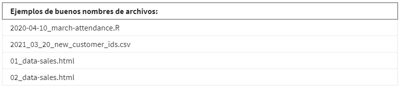
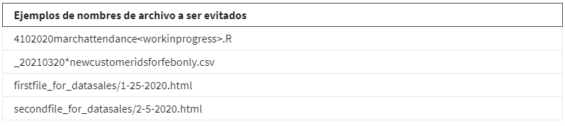
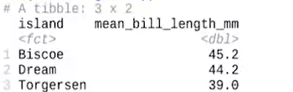
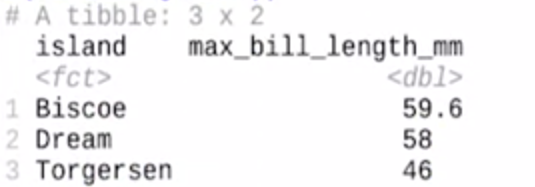

# Limpiar datos

## Lo basico

Con los marcos de datos, podemos empezar a hacer algunas cosas interesantes como limpiar, estandarizar, manipular y vi-
sualizar datos.

los siguientes paquetes son los utilizados para una limpieza basica de datos:

*El paquete Here*: Este paquete facilita la consulta de los archivos, lo instalamos y cargamos con:

    install.packages("Here")
    lo cargamos con library(here)

*El paquete Skimr:* facilita mucho el resumen de los datos y te permite hojearlos más rápido, lo instalamos y cargamos
con:

    install.packages("Skimr")
    lo cargamos con library(Skimr)

*El paquete Janitor:* tiene funciones para la limpieza de datos, lo instalamos y cargamos con:

    install.packages("Janitor")
    lo cargamos con library(Janitor)

*El paquete dplyr:* cuya funcion es manipulacion de datos, lo instalamos y cargamos con:

    install.packages("dplyr")
    lo cargamos con library(dplyr)

El siguiente paso es importar el data frame a utiliza o cargar si es de una libreria de R el data frame a usar, para un
ejemplo practico cargaremos el data frame "palmerpenguins" que contiene datos sobre varias especies de pinguinos, de la
siguiente manera:

    install.packages("palmerpenguins")
    lo cargamos con library(palmerpenguins)

Las siguientes es explorar de manera resumida los datos, para obtener su estructura, tipos de datos, columnas, etc, las
siguientes son funciones que nos permiten obtener un resumen del data frame cargado:

Por ejemplo:

    skim_whitout_charts(penguins)

El paquete skim arroja datos sobre el dataframe y su estructura.

    head(penguins)

*filtrar columnas:*

El paquete head nos previsualiza las primeras 10 filas del data frame

    select(species)

mostrara solo las columnas que se indiquen en el comando y excluira las demas

    select(-species)

al anteponer el sgno "-" se mostraran todas las columnas menos la seleccionada en el comando, esto nos permite centrarnos
en grupos de variables especificos del data frame

    rename(nombre_actual_columna=nuevo_nombre_columna)

Permite renombrar una columna determinada

    rename_with(paquete, cambio)

    rename_with(penguins, toupper)
    rename_with(penguins, tolower)

permite estadarizar los nombres de las colummnas de un data frame, por ejemplo que incien en mayusculas

    clean_names(data_frame)
    
    clean_names(penguiens)

limpia los nombres del data_frame, que solo esxitan letras, numero y guiones bajos

## Convenciones de nomenclatura de archivos

Una parte importante de la limpieza de datos es asegurarse de que todos los archivos tienen el nombre correcto. Aunque
las preferencias individuales varían un poco, la mayoría de los analistas suelen estar de acuerdo en que los nombres de
los archivos deben ser precisos, coherentes y fáciles de leer. Esta lectura proporciona algunas pautas generales para que
sigas al nombrar o renombrar tus archivos de datos.

Las convenciones de nomenclatura para los archivos. Esto ayuda a garantizar que cualquier persona que revise tu análisis
-incluido tú mismo- pueda encontrar rápida y fácilmente lo que necesita. A continuación, te ofrecemos algunos consejos
útiles que debes tener en cuenta a la hora de nombrar tus archivos.

*Buenas practicas:*

    Mantén los nombres de los archivos con una longitud razonable

    Usa guiones bajos y guiones para facilitar la lectura

    Empieza o termina el nombre del archivo con una letra o un número

    Usa un formato de fecha estándar cuando corresponda; ejemplo: AAAA-MM-DD

    Usa nombres de archivos relacionados que funcionen bien con la ordenación predeterminada;

    por ejemplo: en orden cronológico o en orden lógico utilizando primero los números

*Malas practicas:*

    Uses caracteres adicionales innecesarios en los nombres de archivo

    Uses espacios o caracteres "ilegales"; ejemplos: &, %, #, < o >

    Empieces o termines el nombre del archivo con un símbolo

    Uses formatos de fecha incompletos o incoherentes; ejemplo M-D-AA

    Uses nombres de archivos relacionados que no funcionan bien con el ordenamiento predeterminado;
    
    ejemplos: un sistema aleatorio de números o formatos de fecha, o utilizar letras primero

## Organiza tus datos

Para cumplir el objetivo de convertir los datos en conociemientos, el primer paso es tener datos filtrados y organizados
aqui algunas funciones qu enos permitiran lograr esto, estas funciones son pertenecientes al nucleo del tidyverse, asi que
es requerido tenerlo instalado y cargado de esto se realiza de la siguiente manera:

    install.package("tidyverser")
    library(tidyverser)

### funcion arrange()

arrange, nos permite ordenar de acuerdo al nombre de columna que le indiquemos y actua sobre el data frame cargado, su sintaxys
es, arrange y el nombre de la columna por la cual ordenaremos el data frame:

    arrange(nobre_columna)

ejemplo

    library(penguins)
    arrange(bill_lenght_mm)

    o

    penguis %<% arrange(bill_lenght_mm)

arrange ordena de manera ascendente por defecto, para descendente seria:

    library(penguins)
    arrange(-bill_lenght_mm)

    o

    penguis %<% arrange(-bill_lenght_mm)

*Nota* es posible almacenar la salida del arrange como un nuevo data frame asignando su salida a una nueva variable,
por ejemplo:

    penguis2 <- penguis %<% arrange(-bill_lenght_mm)

### funcion group_by()

Esta funcion nos permite agrupar datos segun la colummna en la que se encuentren, su sintaxys seria:

    grupo_by(columna)

cabe anotar que el data frame debe estar previamente cargado para ello

la *funcion drop_NA* nos permite eliminar los datos faltantes, que llevan el NA en un data frame su sintasys

    drop_NA()

La sintaxys anterior sin argumentos aplicara la eliminacion en todo el data frame, actuar con precaucion.

la *funcion mean()* calcula la media de los datos en una colummna, asl ser utilizada con la funcion summarize entregará
un resumen de la misma.

Oomo ejemplo la siguiente instruccion, agrupa por isla, elimina los NA y realiza un resumen teniendo
en cuenta la media de la columna bill_length_mm de la siguiente manera:

    penguins %>% group_by(islands) %>% drop_na %>% summarize(mean_bill_length_mm = mean(bill_length_mm))

lo anterior creara un nuevo data frame similar al siguiente:

la *funcion max()* calcula el maximo de los datos en una colummna, asl ser utilizada con la funcion summarize entregará
un resumen de la misma.

Oomo ejemplo la siguiente instruccion, agrupa por isla, elimina los NA y realiza un resumen teniendo en cuenta los maximos
de la columna bill_length_mm de la siguiente manera:

    penguins %>% group_by(islands) %>% drop_na %>% summarize(mean_bill_length_mm = max(bill_length_mm))

lo anterior creara un nuevo data frame similar al siguiente:

### funcion filter()
