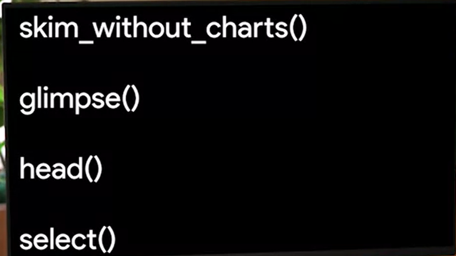

# Limpiar datos

## Lo basico

Con los marcos de datos, podemos empezar a hacer algunas cosas interesantes como limpiar, estandarizar, manipular y vi-
sualizar datos.

los siguientes paquetes son los utilizados para una limpieza basica de datos:

*El paquete Here*: Este paquete facilita la consulta de los archivos, lo instalamos y cargamos con:

    install.packages("Here")
    lo cargamos con library("here")

*El paquete Skimr:* facilita mucho el resumen de los datos y te permite hojearlos más rápido, lo instalamos y cargamos
con:

    install.packages("Skimr")
    lo cargamos con library("Skimr")

*El paquete Janitor:* tiene funciones para la limpieza de datos, lo instalamos y cargamos con:

    install.packages("Janitor")
    lo cargamos con library("Janitor")

*El paquete dplyr:* cuya funcion es manipulacion de datos, lo instalamos y cargamos con:

    install.packages("dplyr")
    lo cargamos con library("dplyr")

El siguiente paso es importar el data frame a utiliza o cargar si es de una libreria de R el data frame a usar, para un
ejemplo practico cargaremos el data frame "palmerpenguins" que contiene datos sobre varias especies de pinguinos, de la
siguiente manera:

    install.packages("palmerpenguins")
    lo cargamos con library("palmerpenguins")

Las siguientes es explorar de manera resumida los datos, para obtener su estructura, tipos de datos, columnas, etc, las
siguientes son funciones que nos permiten obtener un resumen del data frame cargado:

Por ejemplo:

    skim_whitout_charts(penguins)

El paquete skim arroja datos sobre el dataframe y su estructura.

    head(penguins)

El paquete head nos previsualiza las primeras 10 filas del data frame

    select(species)

mostrara solo las columnas que se indiquen en el comando y excluira las demas

    select(-species)

al anteponer el sgno "-" se mostraran todas las columnas menos la seleccionada en el comando, esto nos permite centrarnos
en grupos de variables especificos del data frame
