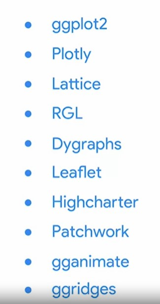
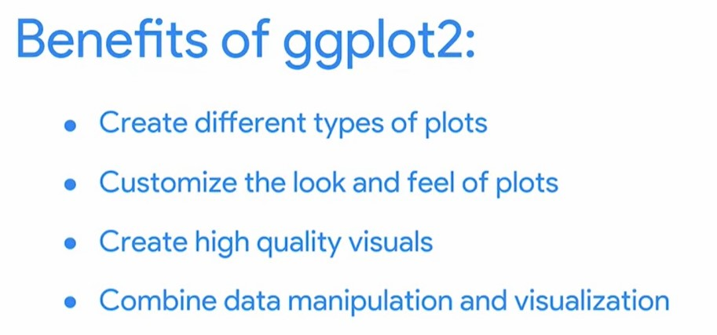
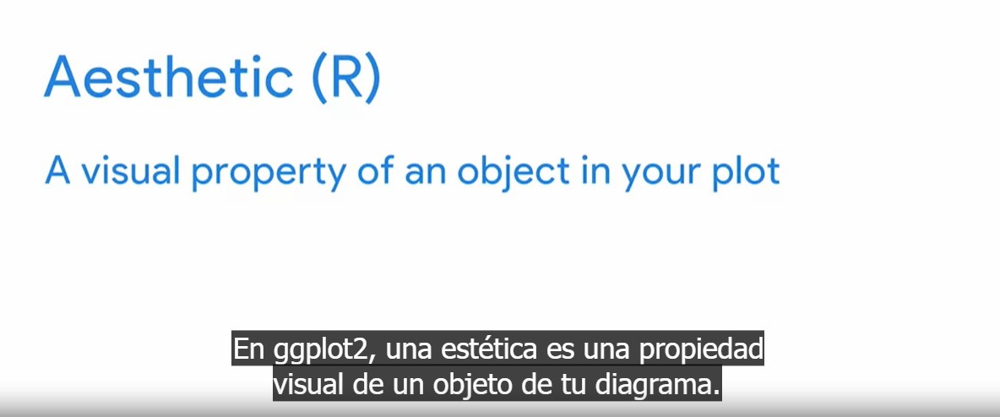
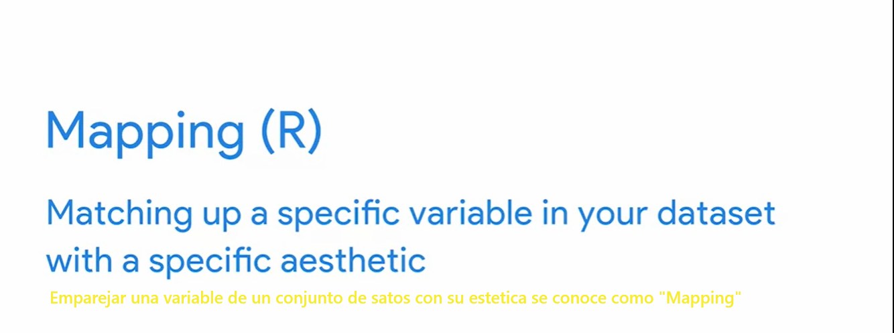
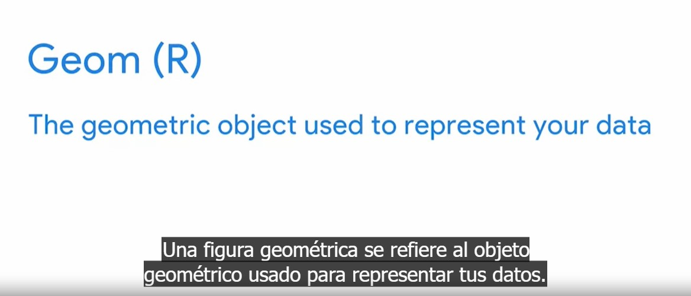
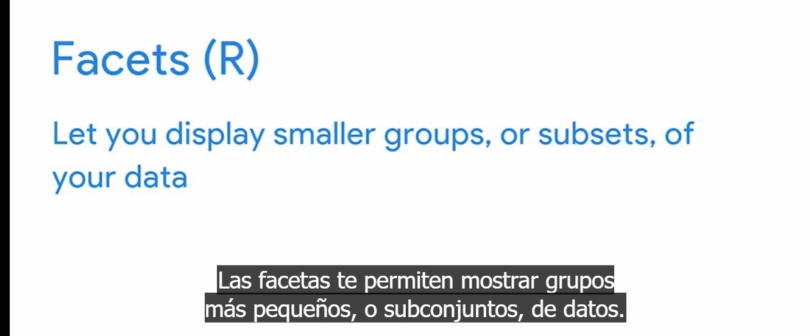
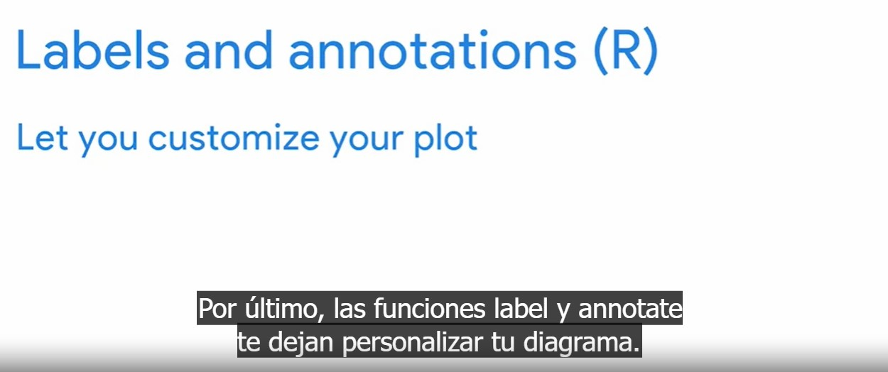
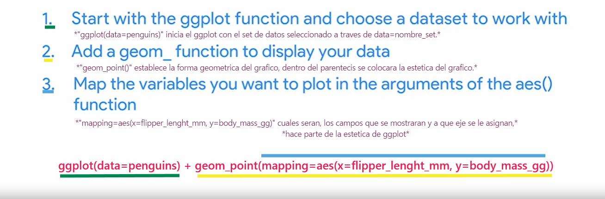
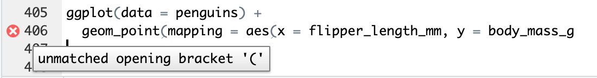

# Crear visualizaciones de datos en R

Ejemplos de paquetes de visualizacion de datos para R

La libreria mas utilizada en R para visualizacion de datos es ggplot2, que pertenece al paquete de tidyverse.

Algunos beneficios de ggplot2

Los conceptos basicos en ggplot2 son:

Aesthetic

Mapping

Geoms o formas geometricas, incluyen, puntos, barras, lineas, etc

Facets

Labels and annotations

Los puntos muestran la relación entre dos variables cuantitativas. Las barras muestran una variable cuantitativa que varía
entre diferentes categorías.

## Sintaxys ggplot2 basica

Una secuencia basica para la creacion de una visualizacion en ggplot2 seria algo como:

cargar el data ser + geoms a mostrar

    ggplot(data=penguins) + geom_point(mapping=aes(x=flipper_lenght_mm, y=body_mass_gg))

*"ggplot(data=penguins)" inicia el ggplot con el set de datos seleccionado a traves de data=nombre_set.*

*"+" agraga capas al ggplot, para formar el grafico y sus caracteristicas.*

*"geom_point()" establece la forma geometrica del grafico, dentro del parentecis se colocara la estetica del grafico.*

*"mapping=aes(x=flipper_lenght_mm, y=body_mass_gg)" cuales seran, los campos que se mostraran y a que eje se le asignan,*
                                                  *hace parte de la estetica de ggplot*

### plantillas para visualizacion en ggplot

Para evitar la repeticion de codigo es posible reemplazr por variables ciertas porciones del codigo, apar ello utilizamos:

    <Aqui_La_Variables>

la sintaxys anterior le indica a R que es posible realizar el cambio de ese trozo de codigo por la variable previamente
dedinida, por ejemplo:

    ggplot(data=<data_set>) + <geom_function>(mapping=aes(x=<axes_x>, y=<axes_y>))

donde

    data_set = dataset_name
    geom_function = geoms_form
    axes_x = campo del sata set para el eje x
    axes_y = campo del sata set para el eje y

por ejemplo

    data_set = penguins
    geom_function = geom_point
    axes_x = flipper_lenght_mm
    axes_y = body_mass_gg

    ggplot(data=<data_set>) + <geom_function>(mapping=aes(x=<axes_x>, y=<axes_y>))

## Problemas mas comunes al visualizar en R

### Es case sensituve, distingue mayuculas y minusculas

El código R distingue entre mayúsculas y minúsculas. Si utilizas accidentalmente mayúsculas en la primera letra de una
determinada función, podría afectar tu código. Aquí hay un ejemplo:

    Glimpse(penguins)

El mensaje de error te avisa que R no puede encontrar una función llamada “Glimpse”:

    Error in Glimpse(penguins) : could not find function "Glimpse"

Pero sabes que la función glimpse (con “g” minúscula) sí existe. Observa que el mensaje de error no explica exactamente
qué está mal, pero sí te señala en una dirección.

Basado en eso, puedes descifrar que este es el código correcto:

    glimpse(penguins)

### Los parentecis de cierre y apertura deben coincidir

Otro error común al programar en R involucra los paréntesis y las comillas. En R, debes asegurarte de que cada paréntesis
de apertura de tu función tenga un paréntesis de cierre y de que cada comilla de apertura tenga una comilla de cierre.

Por ejemplo, si ejecutas el siguiente código, no sucede nada. R no crea el diagrama. Eso se debe a que a la segunda línea
de código le faltan dos paréntesis de cierre:

    ggplot(data = penguins) +

    geom_point(mapping = aes(x = flipper_length_mm, y = body_mass_g

RStudio sí te alerta que existe un problema. A la izquierda de la línea de código en tu editor de código fuente de RStudio,
quizás observes un círculo rojo con una “X” blanca en el centro. Si pasas el cursor por encima del círculo, aparece este
mensaje:

RStudio te avisa que tienes un paréntesis de apertura suelto. Entonces, para corregir el código, sabes que tienes que
agregar un paréntesis de cierre para cada paréntesis de apertura.

Este es el código correcto:

    ggplot(data = penguins) +

    geom_point(mapping = aes(x = flipper_length_mm, y = body_mass_g))

### uso del signo (+)

El signo mas ("+") debe agregarse para crear la capa de visualizacion y siempre al final de la lina de codigo, dispara
error en cualquier otra posicion.

En ggplot2, necesitas agregar un signo más (“+”) a tu código cuando agregas una nueva capa a tu diagrama. Colocar el
signo más en el lugar incorrecto es un error común. El signo más siempre debería colocarse al final de una línea de código,
no al principio de la línea.

Este es un ejemplo de código que incluye una ubicación incorrecta del signo más:

    ggplot(data = penguins)

    + geom_point(mapping = aes(x = flipper_length_mm, y = body_mass_g))

En este caso, el mensaje de error de R identifica el problema y te indica que lo corrijas:

    Error: Cannot use `+.gg()` with a single argument. Did you accidentally put + on a new line?

Este es el código correcto:

    ggplot(data = penguins) +

    geom_point(mapping = aes(x = flipper_length_mm, y = body_mass_g))

Además, puedes usar accidentalmente una canalización en vez de un signo más para agregar una nueva capa a tu diagrama, así:

    ggplot(data = penguins)%>%

    geom_point(mapping = aes(x = flipper_length_mm, y = body_mass_g))

Luego recibes el siguiente mensaje de error:

    Error: `data` must be a data frame, or other object coercible by `fortify()`, not an S3 object with class gg/ggplot

Este es el código correcto:

    ggplot(data = penguins) +

    geom_point(mapping = aes(x = flipper_length_mm, y = body_mass_g))

Tener estos temas en cuenta y prestar atención a los detalles al escribir código te ayudará a reducir errores y ahorrar
tiempo, para que puedas mantenerte enfocado en tu análisis.

### Otras recomendaciones

las palabras reservadas del lenguajes deben escribirse tal cual

Los pipes (canalizacion) no funcionan como objetos de cracion de capas debe ser el signo + ("+")

Para obtener ayuda sobre un afuncion escribir, basta con escribir el signo de interrogacion "?", seguido del nombre de la
funcion que buscamos:

    ?El_nombre_de_la_funcion
