# Explora la estética en el análisis

## Mejoras a visualizaciones en R

La estética, puedes destacar puntos claves de tus datos y comunicarte con mayor claridad y efectividad con tus interesados.

*Estética* es una propiedad visual de un objeto en tu diagrama. Por ejemplo, en un diagrama de dispersión la estética incluye
el tamaño, la forma y el color de tus puntos de datos. Puedes mostrar un punto de diferentes maneras modificando su es-
tética o su apariencia.

Podemos modificar, forma, color, tamaño, etc de nuestro diagramas de dos maneras, una utilizando las variables asociadas
a la funcion aes de la mapping, separadno con una como y agragando el atributo a modificar por ejemplo, lo siguiente
cambiara el color del grafico para distinguir la especies y la forma:

    ggplot(data=penguins) + geom_point(mapping=aes(x=flipper_lenght_mm, y=body_mass_gg, color=species, shape=species))

el resultado

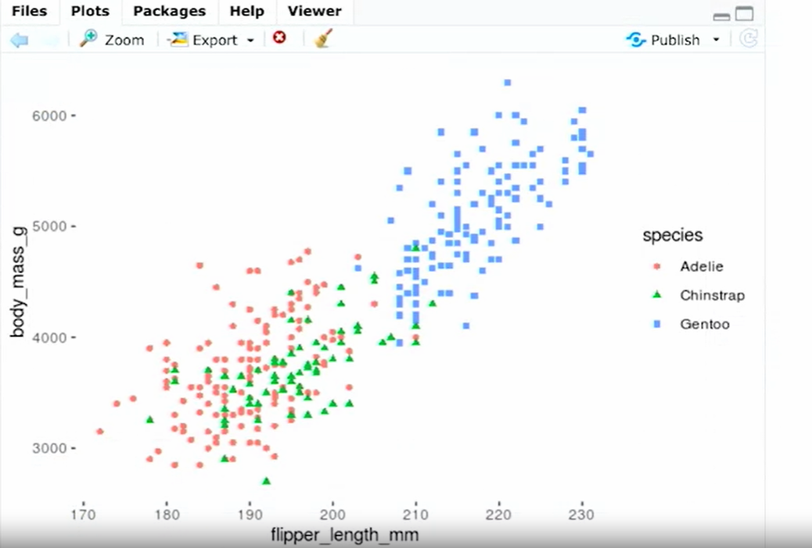

con el atributo alpha aclaramos unos puntos y asentuamos otros para mejorar la viasualizacion para personas con limitaciones
visuales.

esto trabaja con los colores por defecto, si se quiere dar un colo en particular al grafico podriamos hacerlo, colocando
el atributo a modificar fuera del parentecis de la sigueinet forma:

    ggplot(data=penguins) + geom_point(mapping=aes(x=flipper_lenght_mm, y=body_mass_gg), color="purple")

El resultado

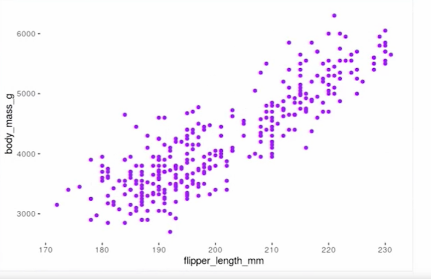

### Atributos estéticos

En esta lectura, aprenderás acerca de tres atributos estéticos básicos a tener en cuenta al crear visualizaciones ggplot2
en R: color, tamaño y forma. Estos atributos son herramientas esenciales para crear visualizaciones de datos con ggplot2
y se incorporan directamente a su código.

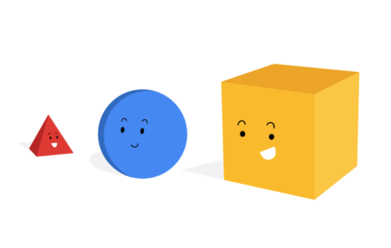

*Estética en ggplot2:*

Ggplot2 es un paquete de R que te permite crear diferentes tipos de visualizaciones de datos directamente en tu lugar de
trabajo R. En ggplot2, una estética se define como una propiedad visual de un objeto de tu diagrama.

Existen tres atributos estéticos en ggplot2:

    Color: te permite modificar el color de todos los puntos de tu diagrama o el color de cada grupo de datos

    Tamaño: te permite modificar el tamaño de los puntos de tu diagrama por grupo de datos

    Forma: te permite modificar la forma de los puntos de tu diagrama por grupo de datos

Este es un ejemplo de cómo se muestran los atributos estéticos en R:

    ggplot(data, aes(x=distance, y= dep_delay, color=carrier, size=air_time, shape = carrier)) +

      geom_point()

Al aplicar estos atributos estéticos a tu trabajo con ggplot2, puedes crear visualizaciones de datos en R que comunican
tendencias con claridad en tus datos.

### Graficos de lineas

La función geom guion bajo smooth es útil para mostrar tendencias generales en nuestros datos. La línea muestra con claridad
la relación positiva entre masa corporal y longitud de aleta. Cuando más grande es el pingüino, más larga es la aleta.
Hasta podemos usar dos figuras geométricas en el mismo diagrama,

La sintaxys seria:

    ggplot(data=penguins) + geom_smooth(mapping=aes(x=flipper_lenght_mm, y=body_mass_gg))

 la salida seria la siguiente:

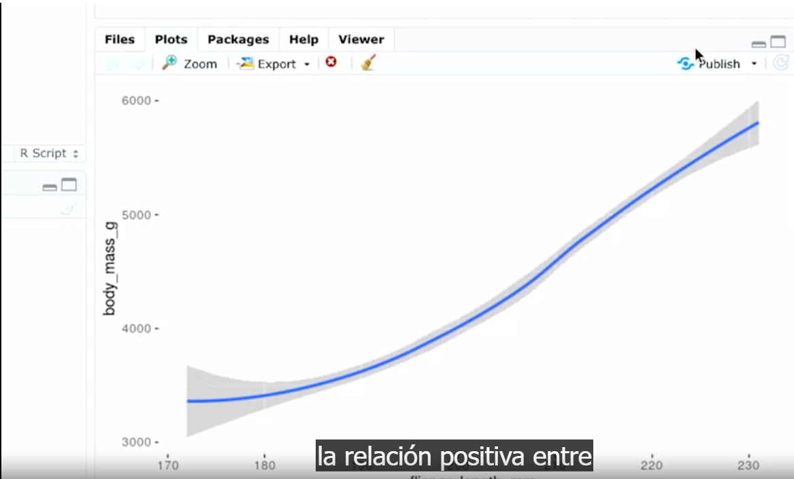

Es posible combinar ambos graficos, con el signo +, por ejemplo:

    ggplot(data=penguins) +
        
        geom_smooth(mapping=aes(x=flipper_lenght_mm, y=body_mass_gg)) +
        
             geom_point(mapping=aes(x=flipper_lenght_mm, y=body_mass_gg))

La salida obtenida seria esta:

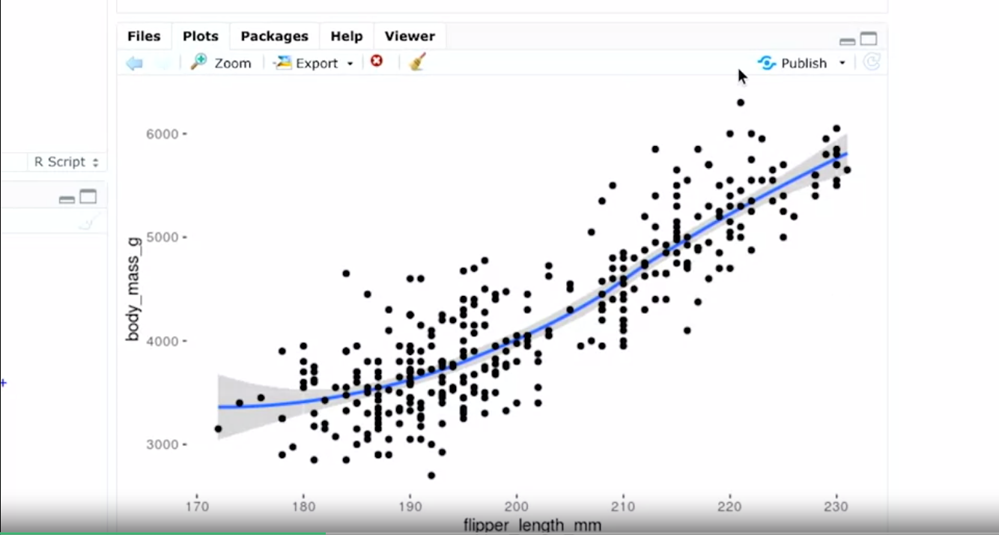

### graficos de dispersion

la funcion geom_jitter, crea un diagrama de dispersion agregando ruido aleatorio a cada punto del diagrama, nos ayuda con
el trazado excesivo, que sucede cuando los puntos se superponen unos ocn otros.

la sintaxys:

    ggplot(data=penguins) +
        
        geom_jitter(mapping=aes(x=flipper_lenght_mm, y=body_mass_gg))

La salida seria

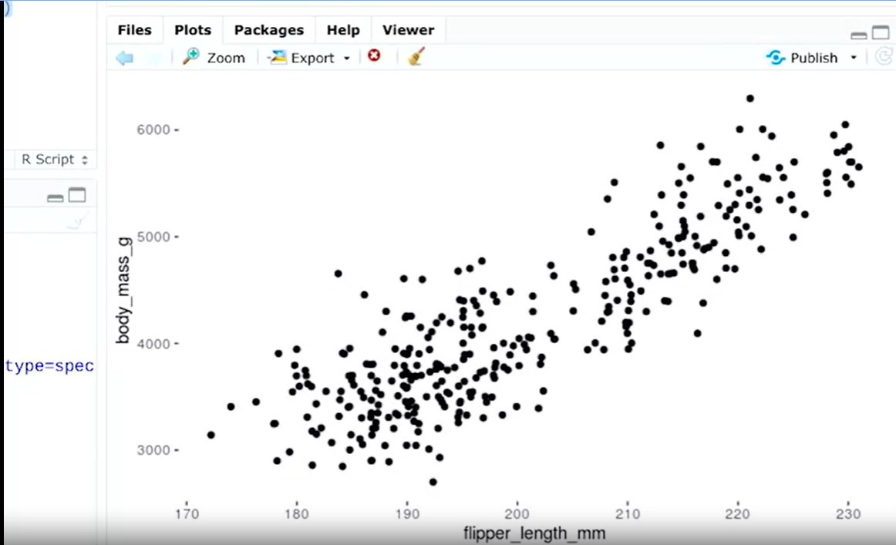

### El grafico de barras

Trazar un diagrama de barras que muestre la variable cut o corte en el dataset de diamantes

    ggplot(data=diamonds) +
        
        geom_bar(mapping=aes(x=cut))

La salida:

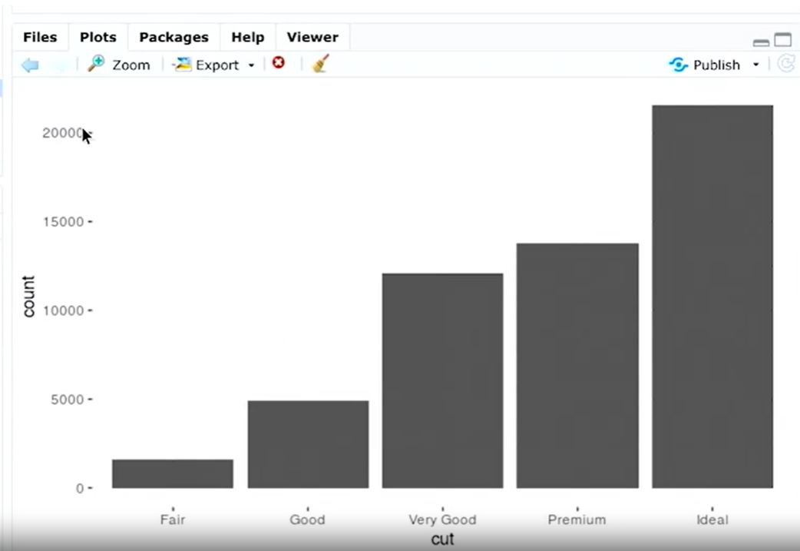

Con el tributo color cambiamos el contorno de las barras para diferencialos y con fill el color de relleno

cambiando el contorno

    ggplot(data=diamonds) +
        
        geom_bar(mapping=aes(x=cut, color=cut))

Cambiando el relleno

    ggplot(data=diamonds) +
        
        geom_bar(mapping=aes(x=cut, fill=cut))

Al agregar una nueva variables se crea un grafico de barrars apiladas, por ejemplo:

    ggplot(data=diamonds) +
        
        geom_bar(mapping=aes(x=cut, fill=cut, fill=clarity))

la salida:

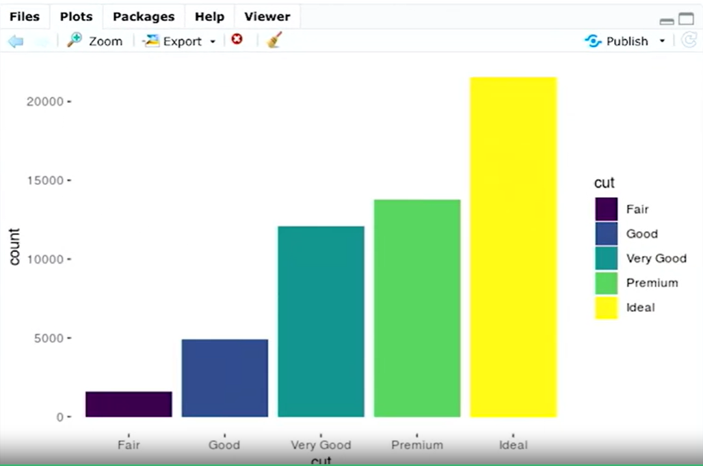

## Suavizado

el suavizado puede usarse para hacer que tus visualizaciones de datos en R sean más claras y fáciles de seguir. A veces,
puede ser difícil comprender tendencias en tus datos solo a través de diagramas de dispersión.

El suavizado permite detectar una tendencia de datos aun cuando no puedes notar con facilidad una tendencia en los puntos
de datos graficados. La funcionalidad de suavizado de ggplot2 es útil porque suma una línea de suavizado como otra capa
en un diagrama; la línea de suavizado ayuda a que un observador casual entienda el sentido de los datos.

por ejemplo:

    ggplot(data, aes(x=distance,
    y= dep_delay)) +
        geom_point() +
        geom_smooth()

la salida:

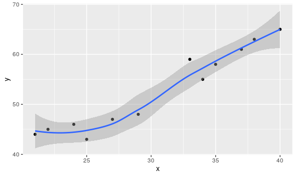

### Dos tipos de suavizado

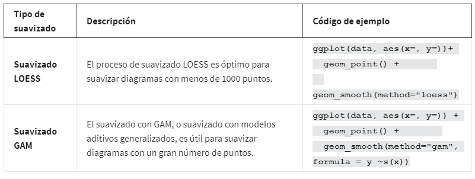

La funcionalidad de suavizado en ggplot2 ayuda a que los diagramas de datos sean más legibles, para que puedas reconocer
mejor las tendencias de datos y sacar conclusiones clave. El primer diagrama que aparece debajo son los datos antes de
suavizar y el segundo diagrama son los mismos datos después de suavizar.

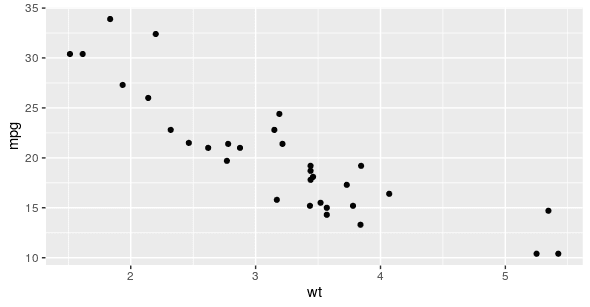

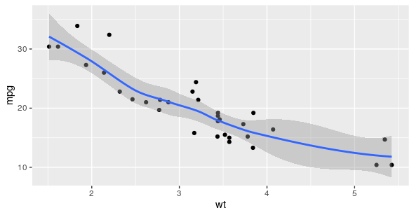

## Estetica y facetas

Las funciones de facetas te dejan mostrar grupos más pequeños, o subconjuntos, de datos. Una faceta es una cara o una
sección de un objeto, como las caras de una piedra preciosa. Las facetas muestran diferentes caras de tus datos colocando
cada subconjunto en su propio diagrama. El uso de facetas te ayudará a descubrir nuevos patrones en tus datos y enfocarte
en relaciones entre diferentes variables.

Ggplot2 tiene dos funciones para facetas: facet guion bajo wrap y facet guion bajo grid.

facet_wrap: permite crear graficos separados, por ejemplo el siguiente codigo mostrara graficos separados para cada especie
de pinguinos

    ggplot(data=penguins) +
        geom_point(mapping=aes(x=flipper_lenght_mm, y=body_mass_gg)) +
            facet_wrap(~spicies)

la salida:

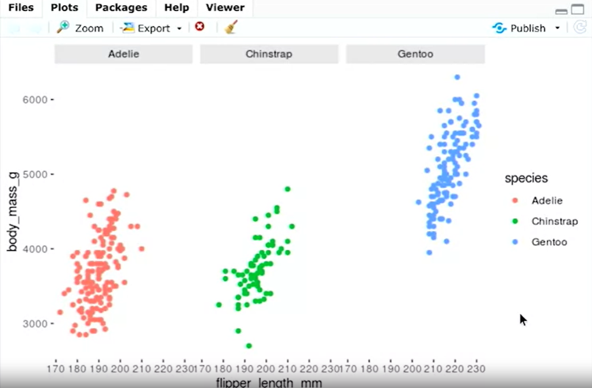
