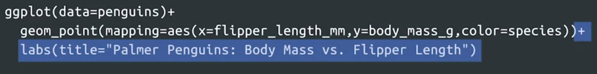
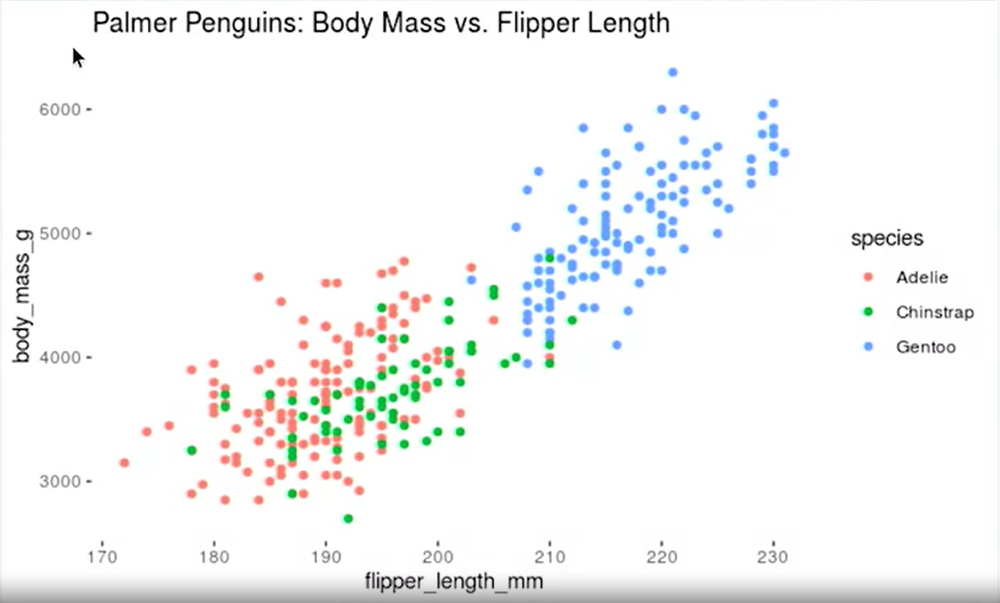

# Anota y guarda visualizaciones

## Capa de anotaciones

Anotar significa agregar notas a un documento o diagrama, para explicar o comentar o resaltar un punto de este, el proposito
del diagrama.

Es de gran utilidad agregar etiquetas informativas a un diagrama, como titulos, subtitulos o leyemdas

Para agregar un titulo en un diagrama o grafico en r, colocamos labs() que es una fucnion creqada con dicho objetivos de
la siguiente manera:

    ggplot(data=data_set_name)+
        geaom_(graphic_tipe)()+
            labs(titele="title")

notece que usamos el sigono "+" para agregar una nueva capa al grafico que seria la funcion labs con su titulo entre comillas
ya que requiere un argumento tipo texto.

la salida:

Para agregar un titulo y subtitulo en un diagrama o grafico en r, colocamos labs() que es una fucnion creqada con dicho
objetivos de la siguiente manera:

    ggplot(data=data_set_name)+
        geaom_(graphic_tipe)()+
            labs(titele="title_text", subtitle="subtitle_text")

Para agregar un titulo, subtitulo y leyenda en un diagrama o grafico en r, colocamos labs() que es una fucnion creqada con
dicho objetivos de la siguiente manera:

    ggplot(data=data_set_name)+
        geaom_(graphic_tipe)()+
            labs(titele="title_text", subtitle="subtitle_text", caption="caption_text")
