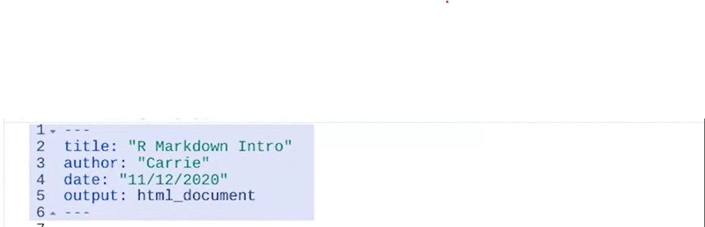

# Crear documentos de R Markdown

## Estructura de los documentos de R Markdown

*Encabezado YAML:*

YAML es un lenguaje para datos que los traduce para que sean legibles. Para el nombre de esta sección se utilizan tres
guiones en la primera y en la última línea. Esa sintaxis crea automáticamente la sección del encabezado YAML cuando se la
utiliza en un archivo RMD.

En un archivo RMD, esa sección es básicamente para los metadatos o para los datos sobre los datos en el resto del archivo.

    El título, el autor, la fecha y el tipo de archivo de un archivo de salida

se incluyen automáticamente cuando creas un nuevo archivo. Hay muchas funciones y opciones de formateo diferentes en esta
sección.

Puedes formatear el texto para incluir enlaces, listas ordenadas, ecuaciones y más.

Adregamos links con "<aqui_el_link.com>"

El simbolo "*" al inicio de una linea cre viñetas
