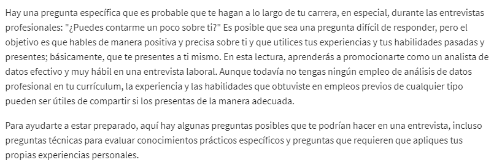
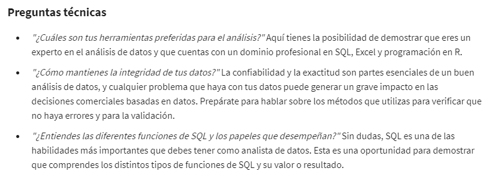
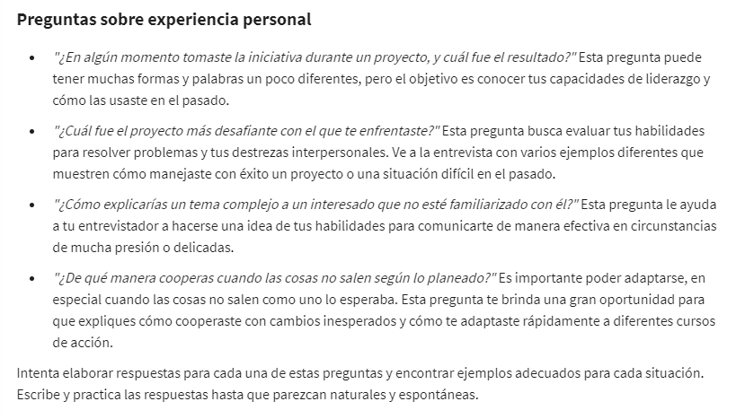
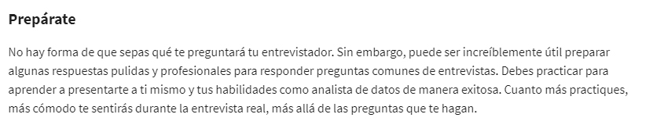
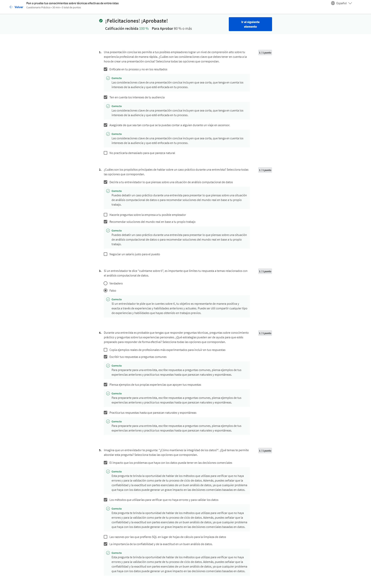

# Loque hace una gran presentacion

Como te vendes garantiza tu inclusion en la nueva contratacion que busca la empresa.

## Sugerencias para la entrevista

## resumen de habilidades para el curriculum u hoja de vida y resumen

Habilidades:

    * Análisis de datos

    * Limpieza de datos

    * Visualización de datos

    * Programación en R

    * Toma de decisiones basada en datos

    * Cálculo y análisis en SQL y en hojas de cálculo

    * Presentaciones efectivas

Ejemplo seccion acerca de

Persona versátil con experiencia en la recopilación, transformación y organización de datos para su análisis con el fin
de ayudar a tomar decisiones informadas. Excelentes conocimientos y dominio de las plataformas para el análisis efectivo
de datos, que incluyen SQL, hojas de cálculo, Tableau y lenguaje R. Sólidas destrezas analíticas, comunicacionales y or-
ganizativas. Recientemente obtuve el Certificado de análisis computacional de datos de Google, un programa riguroso y
práctico que cubre todo el proceso del análisis computacional de datos.

incribirse en el grupo de linkedIN para alumnos de la certificacion en analisis de datos de google:

    [link]<https://www.linkedin.com/groups/13962674/>
